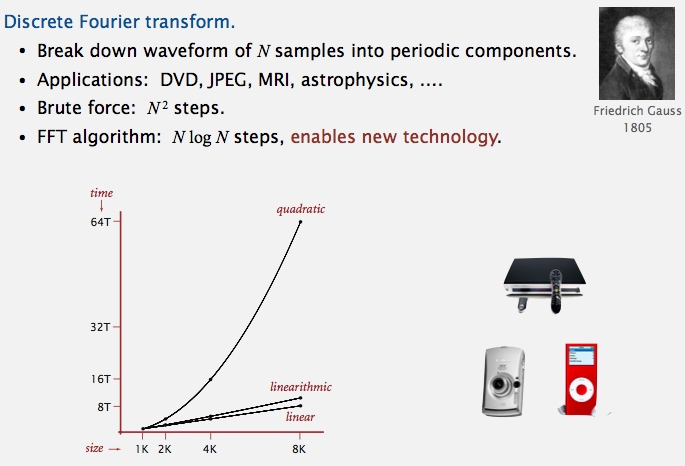
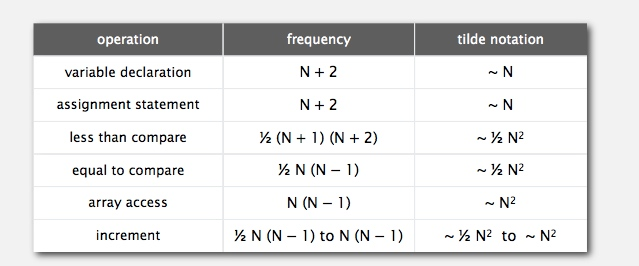
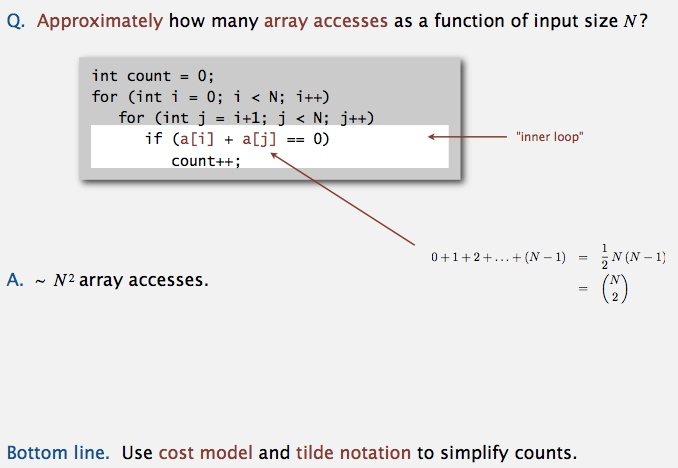
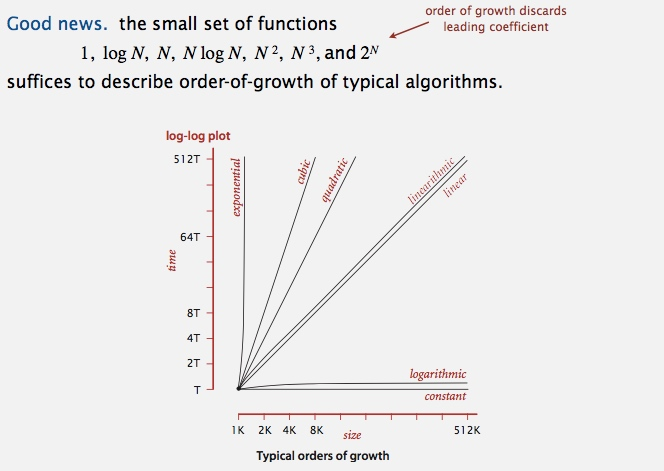
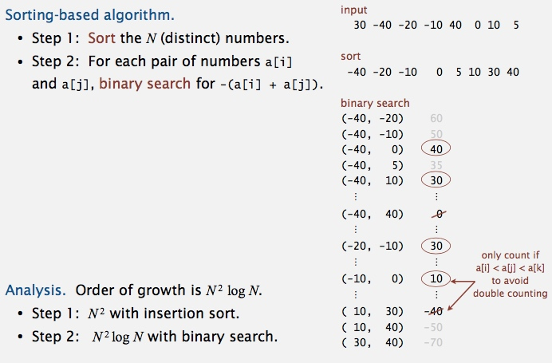
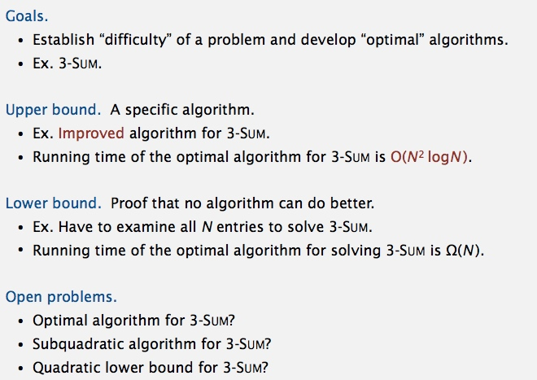

# Analytics of algorithms
## Introduction
**Reasons to analyze algorithms**

**Some algorithmic successes**

**Scientific method applied to analysis of algorithms**

----------------------------------------------------------------

## Observations

**3-SUM: brute-force algorithm**

**Measuring the running time** 

**Empirical analysis** 

**Data analysis** 

**Prediction and validation** 

**Doubling hypothesis** 

**Experimental algorithmics**

----------------------------------------------------------------

## Mathematical Models
**Mathematical models for running time**

**2-Sum** 

**Cost model** 

**Tilde notation** 

**Example** 

**Estimating a discrete sum**

**Mathematical models for running time**

## order-of-growth classifications
**Common order-of-growth classifications**

**Practical implications of order-of-growth**

### Binary search demo

**Java implementation** 

**Mathematical Analysis** 

**An N2 log N algorithm for 3-SUM**

**Comparing programs** 

## Theory of algorithms
**Types of analyses** 

**Theory of algorithms** 

**Commonly-used notations in the theory of algorithms**

**Theory of algorithms: example 1(?)**

**Theory of algorithms: example 2(?)**

**Algorithm design approach(?)**

**Commonly-used notations(?)**

## Memory
**Basics** 

**Typical memory usage for primitive types and arrays**

**Typical memory usage for objects in Java**

**Typical memory usage summary**

**Example** 

## Turning the crank: summary

