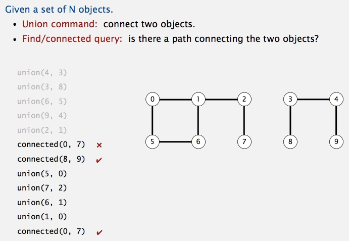
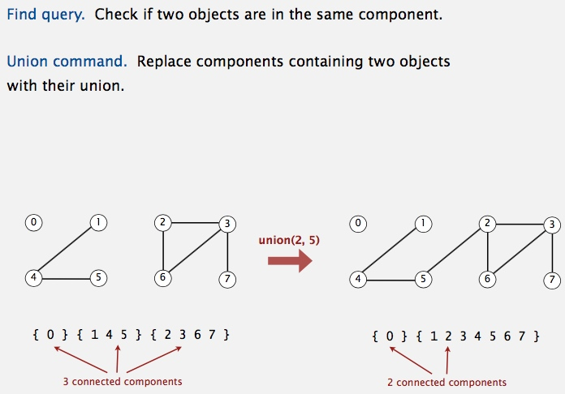
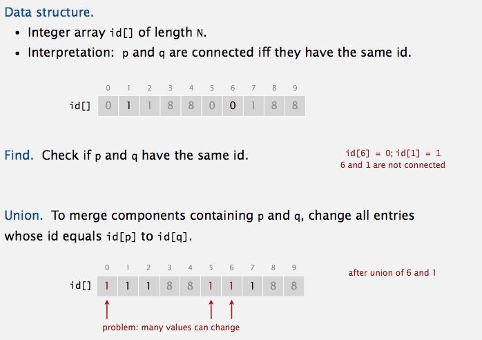
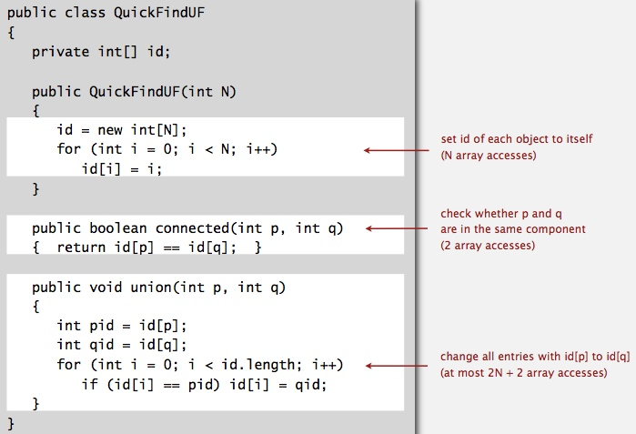
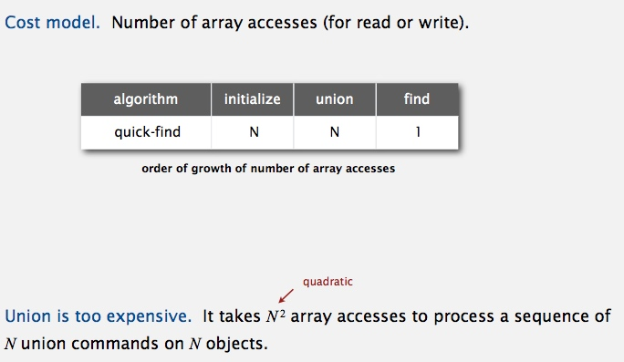
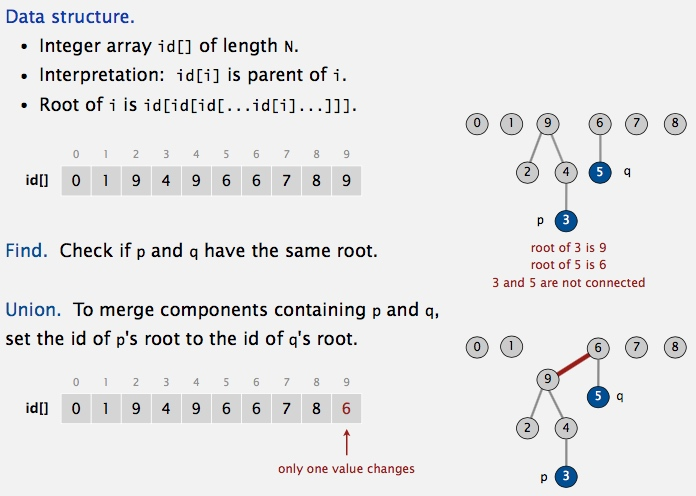

# Union-Find
## Problem: Dynamic connectivity

## Model the problem.
**Modeling the connections**

**Implementing the operations**

**Union-find data type (API)**

----------------------------------------------------------------

## Solutions 
## Quick-Find [eager approach]

**Java implementation** [source code](../java/src/main/java/com/linbo/algs/datatypes/QuickFindUF.java)

**Quick-find is too slow** 

**Quadratic algorithms do not scale !!!**

## Quick-Union [Lazy approach]

**Java implementation** [source code](../java/src/main/java/com/linbo/algs/datatypes/QuickUnionUF.java)

**Quick-union is also too slow**

