# Union-Find
## Problem: Dynamic connectivity
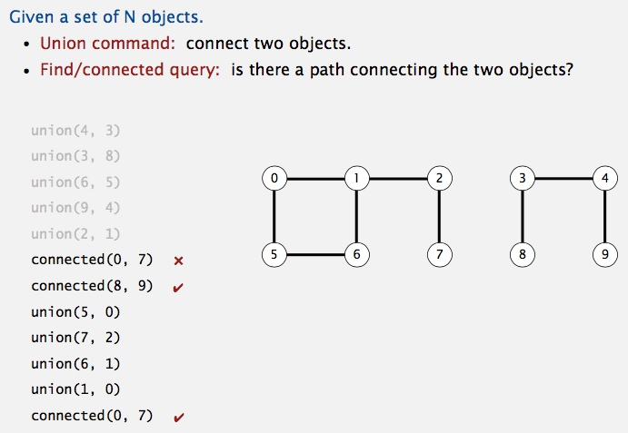

## Model the problem.
**Modeling the connections**
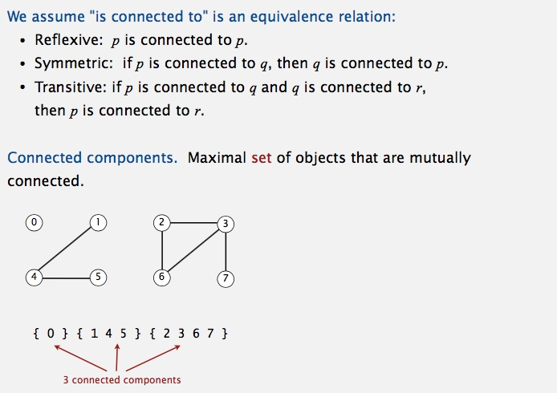

**Implementing the operations**
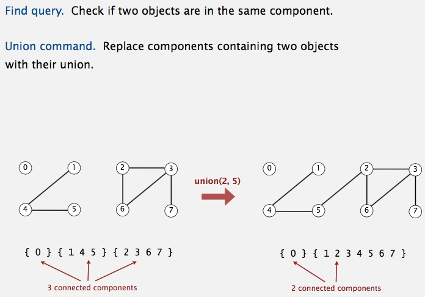

**Union-find data type (API)**
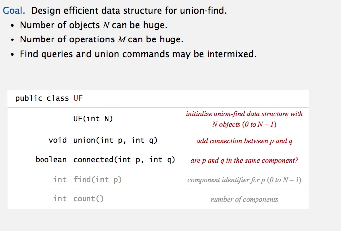

----------------------------------------------------------------

## Solutions 
## Quick-Find [eager approach]  => O(n ^ 2)
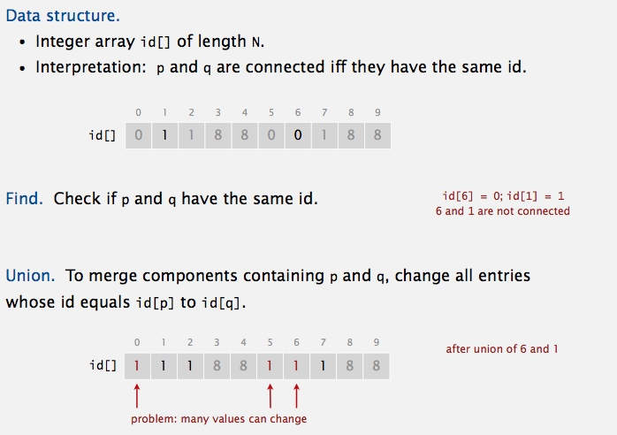

**Java implementation** [source code](../java/src/main/java/com/linbo/algs/datatypes/QuickFindUF.java)
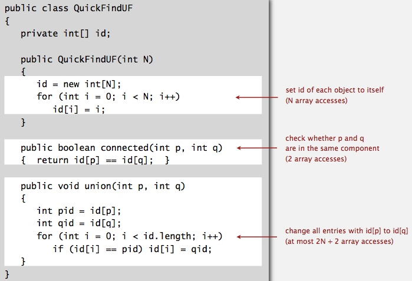

**Quick-find is too slow** 
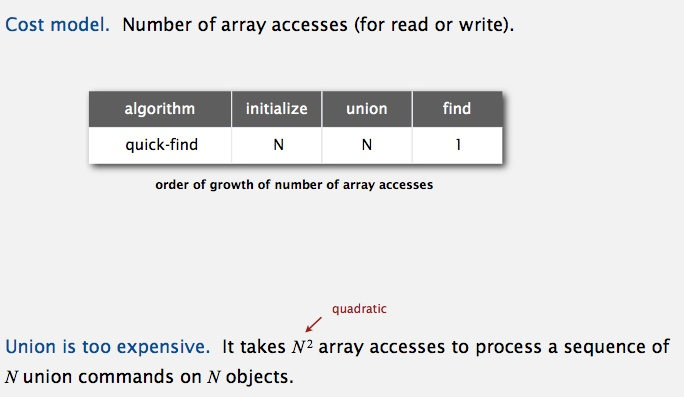

**Quadratic algorithms do not scale !!!**
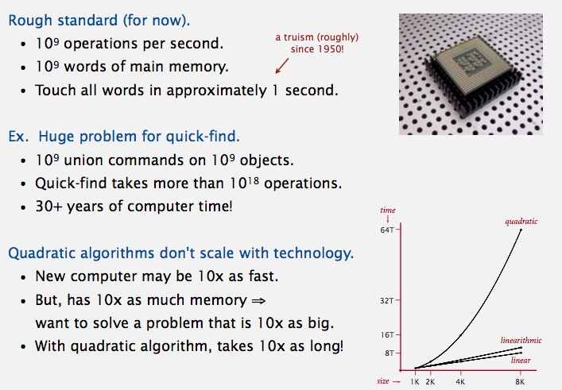

## Quick-Union [Lazy approach] => O(N)
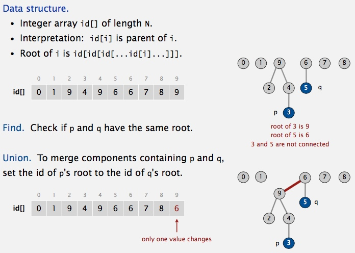

**Java implementation** [source code](../java/src/main/java/com/linbo/algs/datatypes/QuickUnionUF.java)

**Quick-union is also too slow**
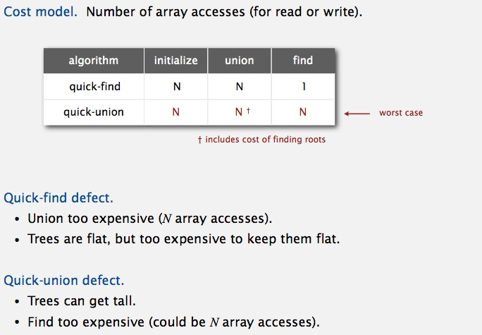

----------------------------------------------------------------

## Improvements
### weighting quick-union => O(lg(n))
Always put smaller tree lower
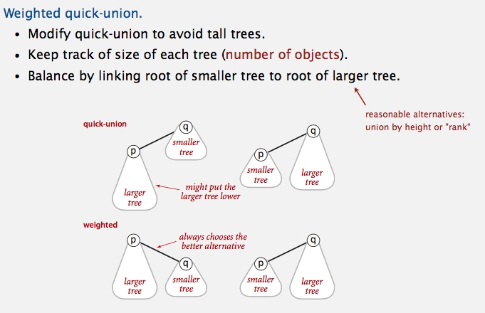

**Quick-union and weighted quick-union example**
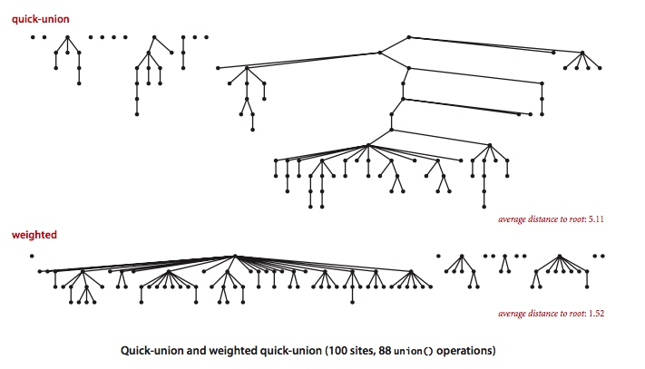

**Java implementation** [source code](../java/src/main/java/com/linbo/algs/datatypes/QuickUnionUF.java)
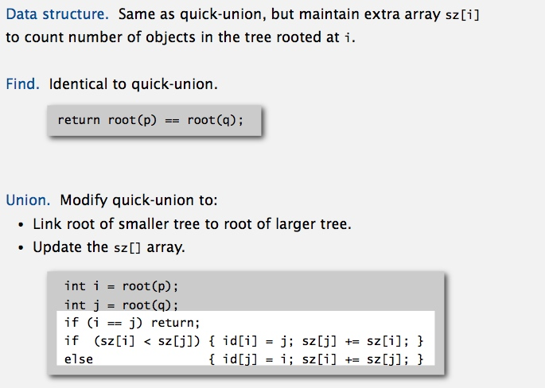

**Weighted quick-union analysis**
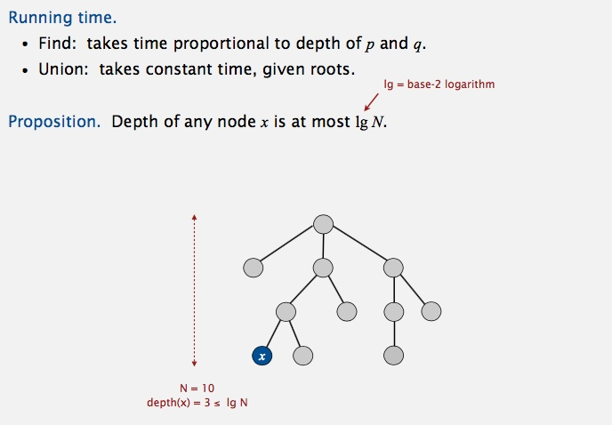
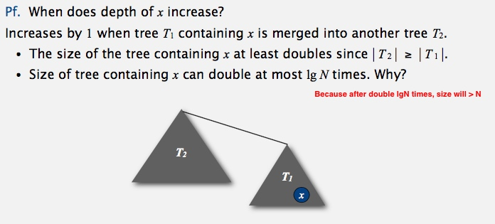
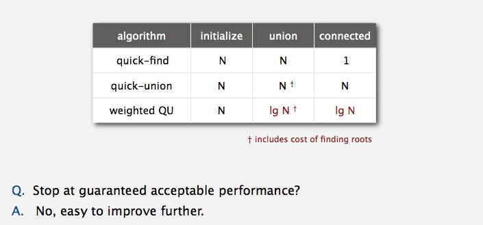

### path compression => O(lg(n))
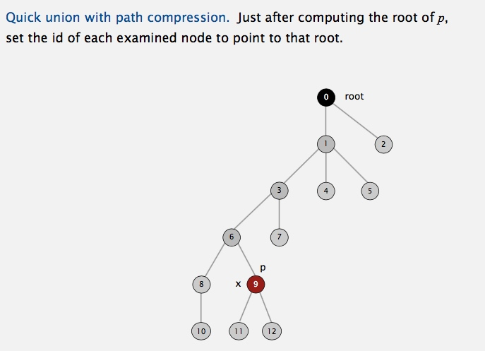

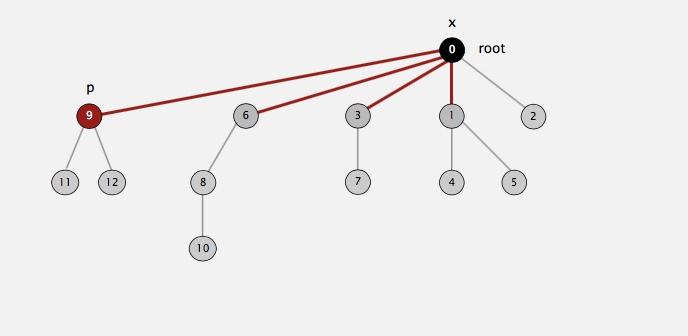

**Java implementation** [source code](../java/src/main/java/com/linbo/algs/datatypes/UF.java)
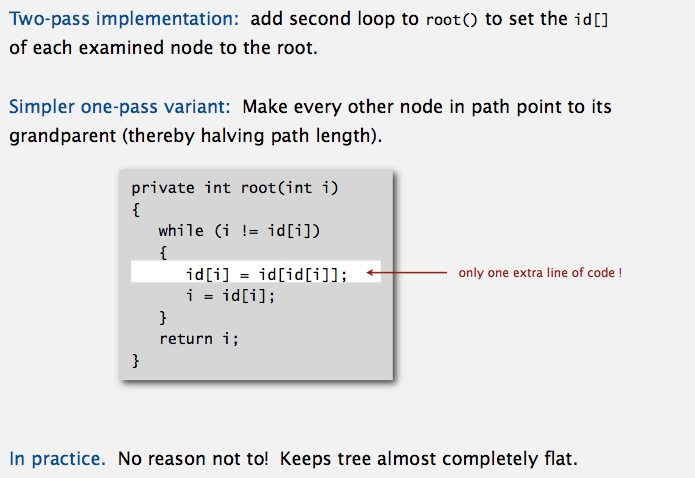

----------------------------------------------------------------

## Summary

----------------------------------------------------------------

## Use case
### Percolation
Assignment: http://coursera.cs.princeton.edu/algs4/assignments/percolation.html   
Solution: [Percolation.java](../java/src/main/java/com/linbo/algs/examples/Percolation.java) and [PercolationStats.java](../java/src/main/java/com/linbo/algs/examples/PercolationStats.java)  
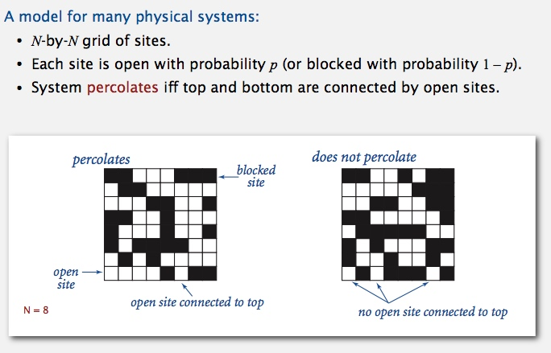

**Likelihood of percolation** 
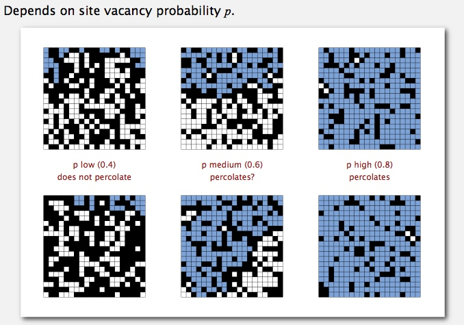
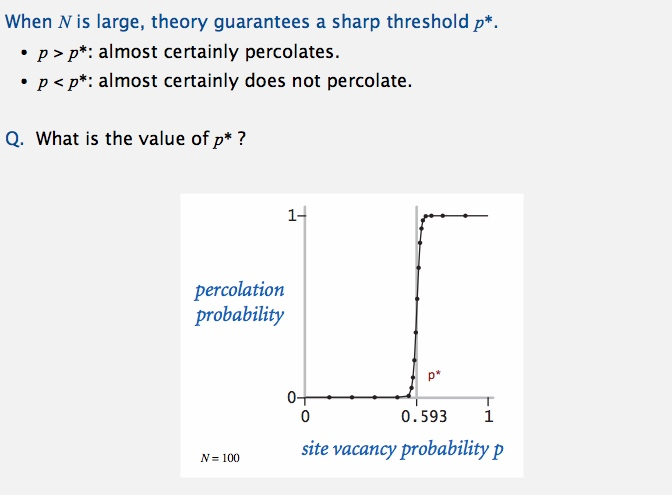

**Monte Carlo simulation** 
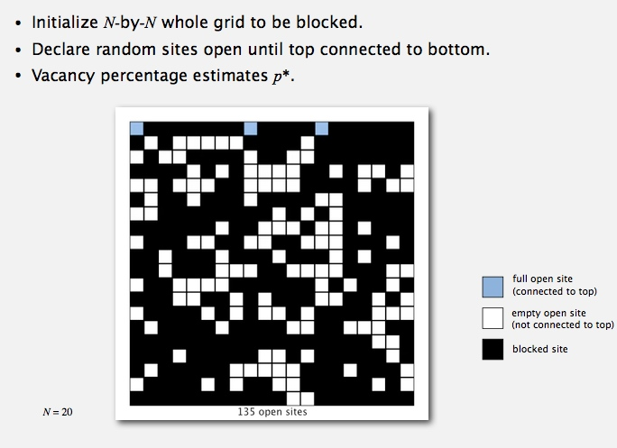

**Dynamic connectivity solution to estimate percolation threshold**
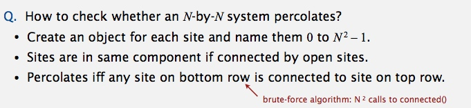
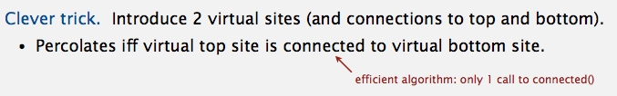
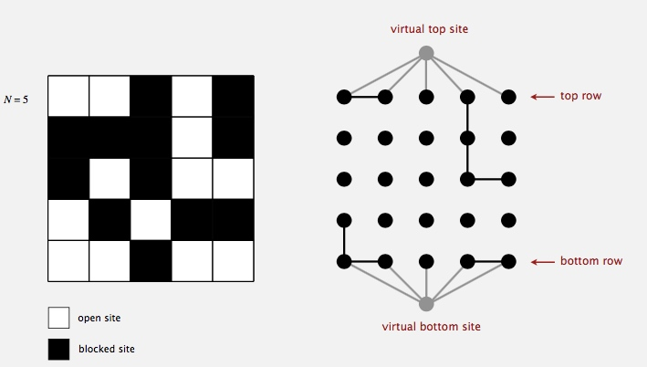
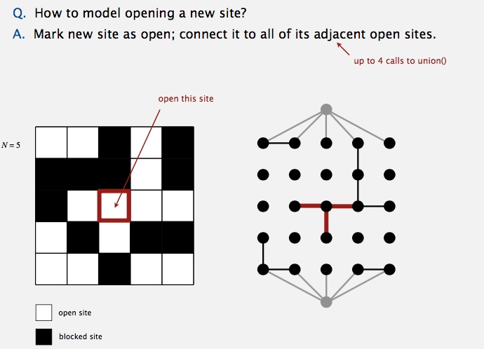

