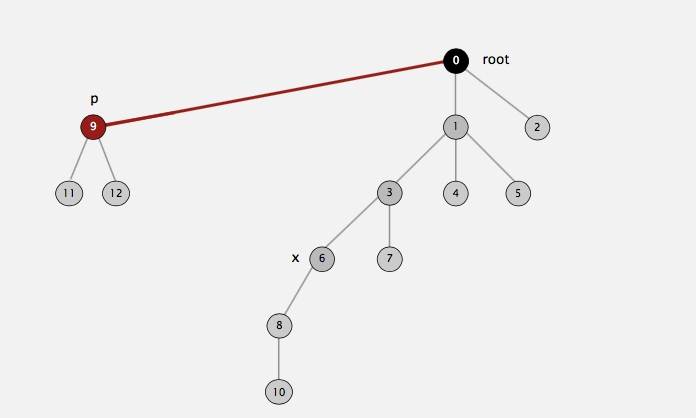
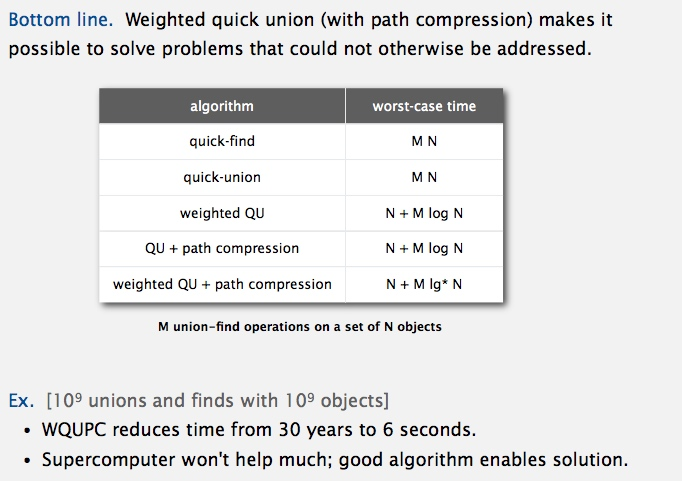

# Union-Find
## Problem: Dynamic connectivity

## Model the problem.
**Modeling the connections**

**Implementing the operations**

**Union-find data type (API)**

----------------------------------------------------------------

## Solutions 
## Quick-Find [eager approach]  => O(n ^ 2)

**Java implementation** [source code](../java/src/main/java/com/linbo/algs/datatypes/QuickFindUF.java)

**Quick-find is too slow** 

**Quadratic algorithms do not scale !!!**

## Quick-Union [Lazy approach] => O(N)

**Java implementation** [source code](../java/src/main/java/com/linbo/algs/datatypes/QuickUnionUF.java)

**Quick-union is also too slow**

----------------------------------------------------------------

## Improvements
### weighting quick-union => O(lg(n))
Always put smaller tree lower

**Quick-union and weighted quick-union example**

**Java implementation** [source code](../java/src/main/java/com/linbo/algs/datatypes/QuickUnionUF.java)

**Weighted quick-union analysis**

### path compression => O(lg(n))

**Java implementation** [source code](../java/src/main/java/com/linbo/algs/datatypes/UF.java)

----------------------------------------------------------------

## Summary

----------------------------------------------------------------

## Use case
### Percolation
Assignment: http://coursera.cs.princeton.edu/algs4/assignments/percolation.html   
Solution: [Percolation.java](../java/src/main/java/com/linbo/algs/examples/Percolation.java) and [PercolationStats.java](../java/src/main/java/com/linbo/algs/examples/PercolationStats.java)  

**Likelihood of percolation** 

**Monte Carlo simulation** 

**Dynamic connectivity solution to estimate percolation threshold**

