# Stacks And Queues
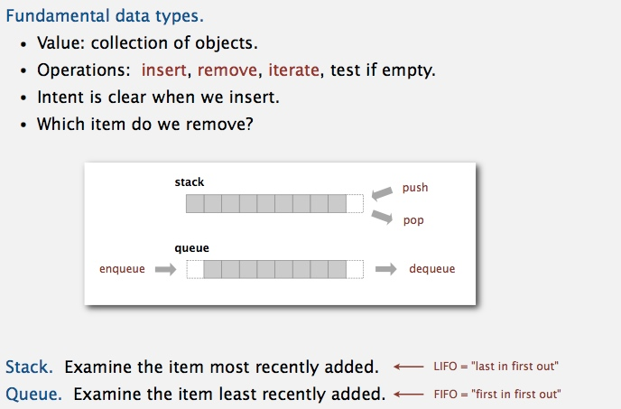
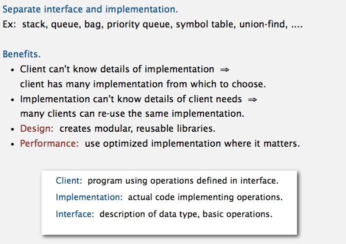

-----------------------------------------------------------------------

## Stack
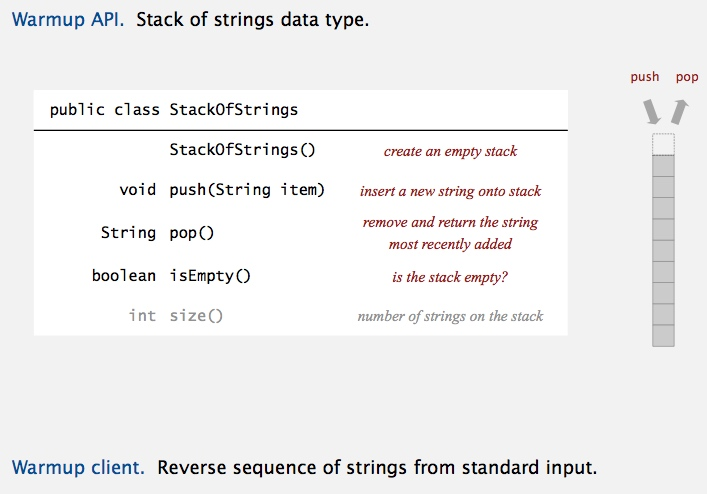

**Stack test client** 
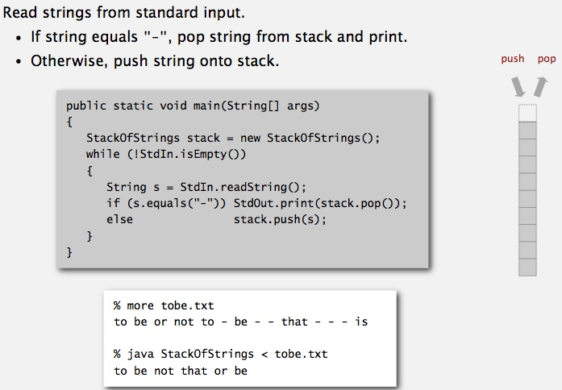

### linked-list representation
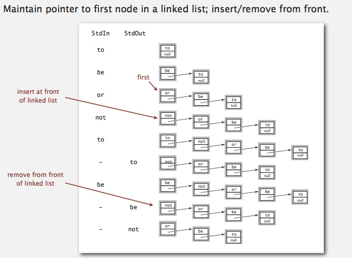

**Stack pop** 
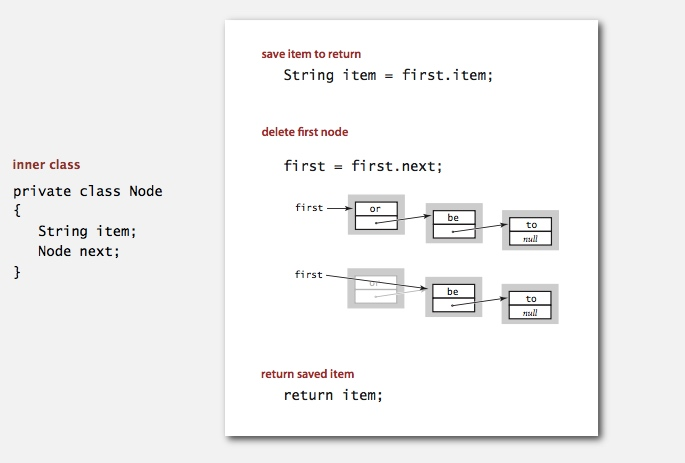

**Stack push** 

**linked-list implementation in Java** 
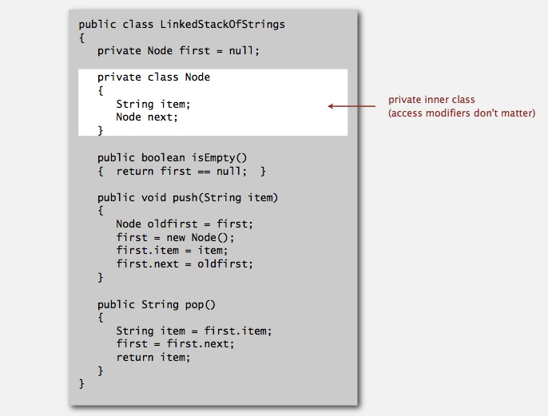

**linked-list implementation performance** 
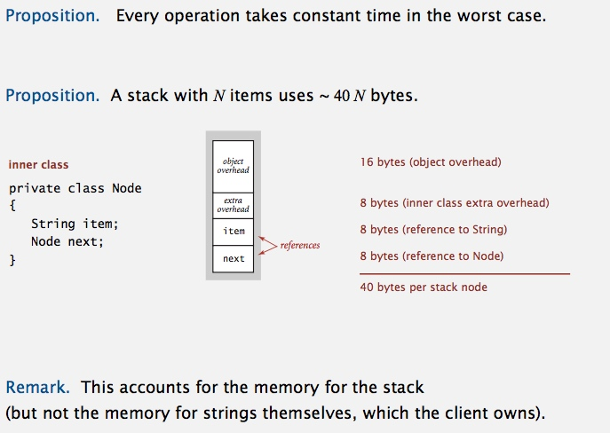

### Stack: array implementation
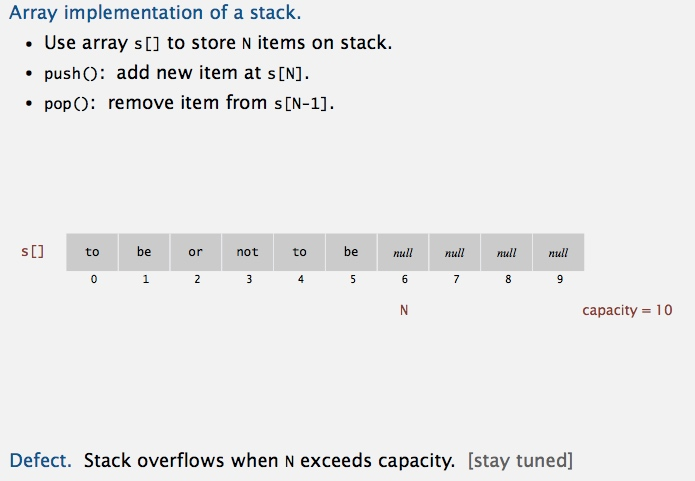
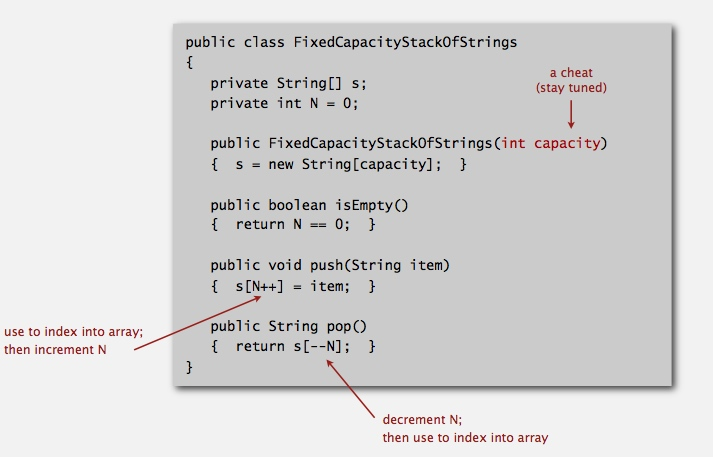

**Stack considerations** 
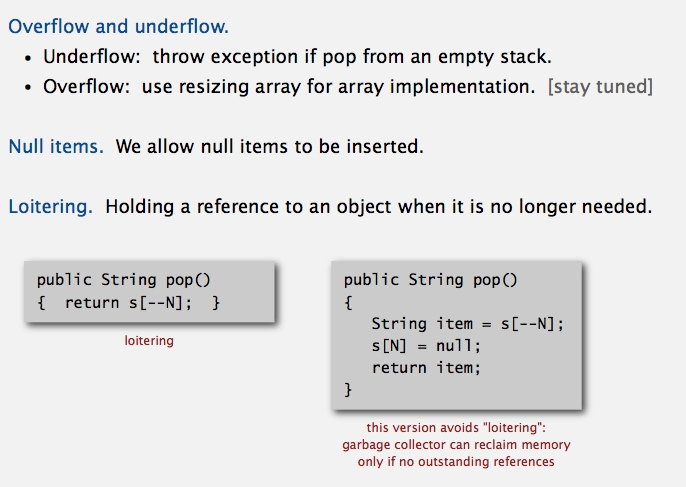

### Stack: resizing-array implementation
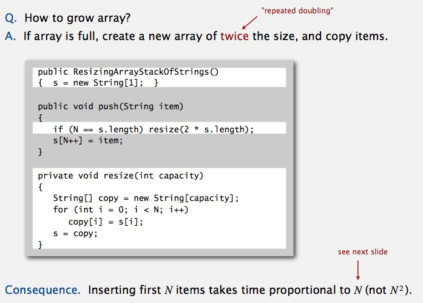

[**amortized cost of adding to a stack**](https://github.com/linbojin/algorithms/blob/master/doc/01-AnalysisOfAlgorithms.md#amortized-cost-analysis) 
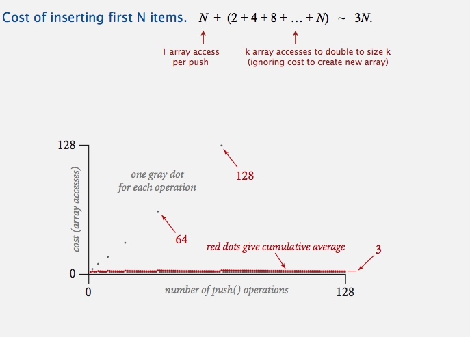

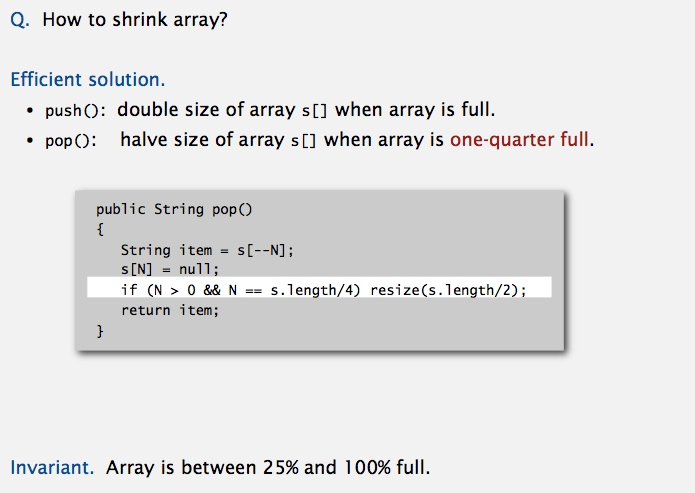

**Stack: resizing-array implementation trace** 
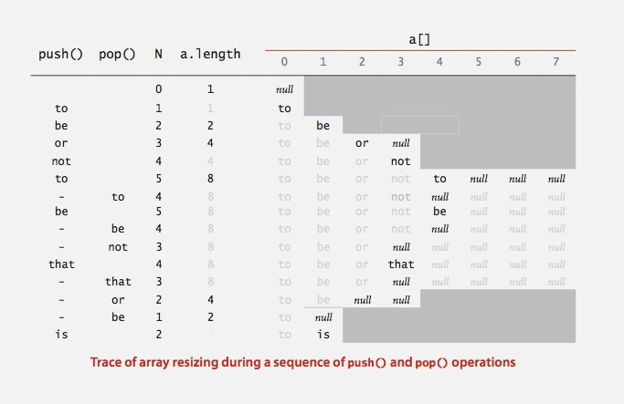

**Stack resizing-array implementation: performance** 
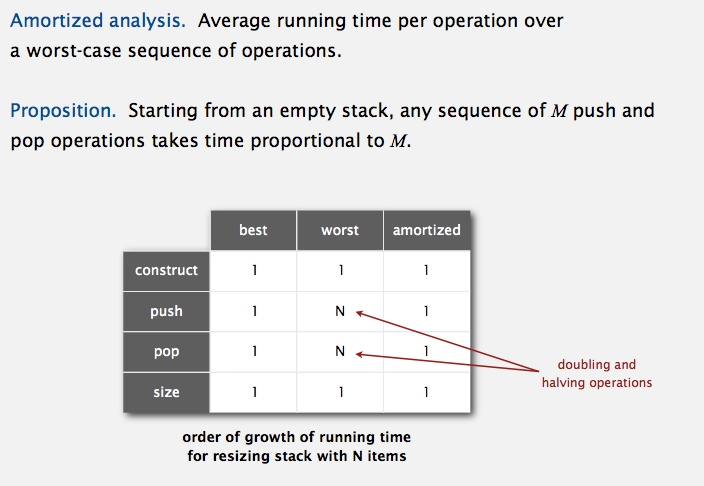

**Stack resizing-array implementation: memory usage** 
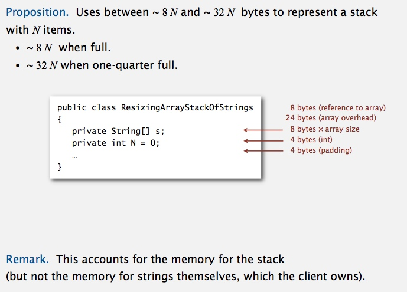

### Stack implementations: resizing array vs. linked list
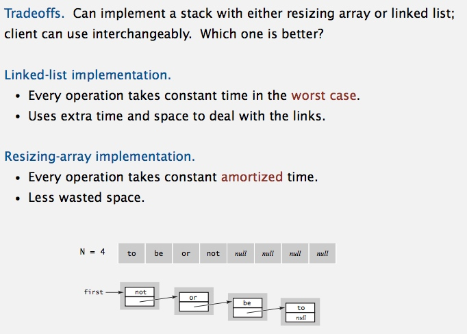

