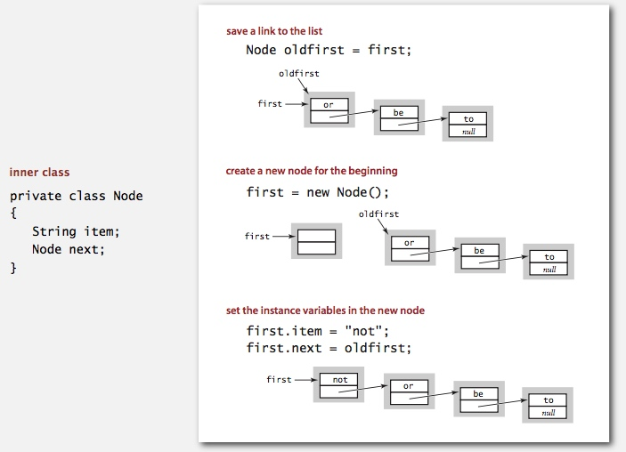

# Stacks And Queues
Table of Contents
=================

   * [Stacks And Queues](#stacks-and-queues)
      * [Stack](#stack)
         * [linked-list representation](#linked-list-representation)
         * [Stack: array implementation](#stack-array-implementation)
         * [Stack: resizing-array implementation](#stack-resizing-array-implementation)
         * [Stack implementations: resizing array vs. linked list](#stack-implementations-resizing-array-vs-linked-list)
      * [Queue](#queue)
         * [Queue: linked-list representation](#queue-linked-list-representation)
         * [Queue: resizing array implementation](#queue-resizing-array-implementation)
      * [Generics](#generics)
      * [Iterators](#iterators)
      * [Bag](#bag)
      * [Stack applications: Arithmetic expression evaluation](#stack-applications-arithmetic-expression-evaluation)
      * [Deques and Randomized Queues](#deques-and-randomized-queues)
         * [Reservoir sampling](#reservoir-sampling)
        


-----------------------------------------------------------------------

## Stack


**Stack test client**<br>


### linked-list representation


**Stack pop**<br>


**Stack push**<br>


**linked-list implementation in Java**<br>


**linked-list implementation performance**<br>


### Stack: array implementation


**Stack considerations**<br>


### Stack: resizing-array implementation


[**amortized cost of adding to a stack**](https://github.com/linbojin/algorithms/blob/master/doc/01-AnalysisOfAlgorithms.md#amortized-cost-analysis)<br>


**Stack: resizing-array implementation trace**<br>


[**Stack resizing-array implementation: performance**](https://github.com/linbojin/algorithms/blob/master/doc/01-AnalysisOfAlgorithms.md#amortized-cost-analysis)<br>

**Stack resizing-array implementation: memory usage**<br>


### Stack implementations: resizing array vs. linked list


-----------------------------------------------------------------------

## Queue


### Queue: linked-list representation


**Queue dequeue: linked-list implementation**<br>


**Queue enqueue: linked-list implementation**<br>


**Queue: linked-list implementation in Java**<br>


### Queue: resizing array implementation


## Generics
**Generic stack: linked-list implementation**<br>


## Iterators


**Stack iterator: linked-list implementation**<br>


**Stack iterator: array implementation**<br>


## Bag


## Stack applications: Arithmetic expression evaluation


**Dijkstra's two-stack algorithm**<br>


**Java implementation**<br>


##  Deques and Randomized Queues
Dequeue: a double-ended queue or deque (pronounced "deck") is a generalization of a stack and a queue that supports adding and removing items from either the front or the back of the data structure. A generic data type Deque API, [Dequeue.java](../java/src/main/java/com/linbo/algs/examples/Dequeue.java) :

```java
public class Deque<Item> implements Iterable<Item> {
   public Deque()                           // construct an empty deque
   public boolean isEmpty()                 // is the deque empty?
   public int size()                        // return the number of items on the deque
   public void addFirst(Item item)          // add the item to the front
   public void addLast(Item item)           // add the item to the end
   public Item removeFirst()                // remove and return the item from the front
   public Item removeLast()                 // remove and return the item from the end
   public Iterator<Item> iterator()         // return an iterator over items in order from front to end
   public static void main(String[] args)   // unit testing (optional)
}
```

Randomized queue: a randomized queue is similar to a stack or queue, except that the item removed is chosen uniformly at random from items in the data structure. Create a generic data type RandomizedQueue API,  [RandomizedQueue.java](../java/src/main/java/com/linbo/algs/examples/RandomizedQueue.java) :

```java
public class RandomizedQueue<Item> implements Iterable<Item> {
   public RandomizedQueue()                 // construct an empty randomized queue
   public boolean isEmpty()                 // is the queue empty?
   public int size()                        // return the number of items on the queue
   public void enqueue(Item item)           // add the item
   public Item dequeue()                    // remove and return a random item
   public Item sample()                     // return (but do not remove) a random item
   public Iterator<Item> iterator()         // return an independent iterator over items in random order
   public static void main(String[] args)   // unit testing (optional)
}
```

Permutation client: Write a client program Permutation.java that takes a command-line integer k; reads in a sequence of strings from standard input using StdIn.readString(); and prints exactly k of them, uniformly at random. Print each item from the sequence at most once. You may assume that 0 ≤ k ≤ n, where n is the number of string on standard input: [Permutation.java](../java/src/main/java/com/linbo/algs/examples/Permutation.java) 

### Reservoir sampling
> Reservoir sampling is a family of randomized algorithms for randomly choosing a sample of k items from a list S containing n items, where n is either a very large or unknown number. Typically n is large enough that the list doesn't fit into main memory. -- [wikipedia page](https://en.wikipedia.org/wiki/Reservoir_sampling)

```
# Algorithm R

(*
  S has items to sample, R will contain the result
 *)
ReservoirSample(S[1..n], R[1..k])
  // fill the reservoir array
  for i = 1 to k
      R[i] := S[i]

  // replace elements with gradually decreasing probability
  for i = k+1 to n
    j := random(1, i)   // important: inclusive range
    if j <= k
        R[j] := S[i]
```

证明： http://www.cnblogs.com/buptLizer/archive/2012/04/08/2437416.html


