# Elementary Sorts
Table of Contents
=================

   * [Elementary Sorts](#elementary-sorts)
      * [Sorting problem](#sorting-problem)
      * [Selection sort](#selection-sort)
      * [Insertion sort](#insertion-sort)
      * [Shell sort](#shell-sort)
      * [Applications](#applications)
         * [shuffling](#shuffling)
         * [Convex hull](#convex-hull)

## Sorting problem

**Callbacks** 

**Total order** 

**Implementing the Comparable interface** 

**Two useful sorting abstractions** 

------------------------------------------------------------------

## Selection sort
[Selection.java](../java/src/main/java/com/linbo/algs/sortings/Selection.java) 
**animation** 
 

**Selection sort inner loop** 

**Java implementation** 

**mathematical analysis** 

------------------------------------------------------------------------

## Insertion sort
[Insertion.java](../java/src/main/java/com/linbo/algs/sortings/Insertion.java) 
**animation** 

 

**Insertion sort inner loop** 

**Java implementation** 

**mathematical analysis** 

**best and worst case** 

**partially-sorted arrays** 

------------------------------------------------------------------------

## Shell sort
[Shell.java](../java/src/main/java/com/linbo/algs/sortings/Shell.java) 
**animation** 

 

**h-sorting** 

**Shellsort example: increments 7, 3, 1** 

**Shellsort: intuition** 

**Shellsort: which increment sequence to use?** 

**Shellsort: Java implementation** 

**Shellsort: visual trace** 

**Shellsort: analysis** 

**Why are we interested in shellsort?** 

------------------------------------------------------------------------

## Applications
### shuffling
[KnuthShuffle.java](../java/src/main/java/com/linbo/algs/examples/KnuthShuffle.java) 
**How to shuffle an array** 
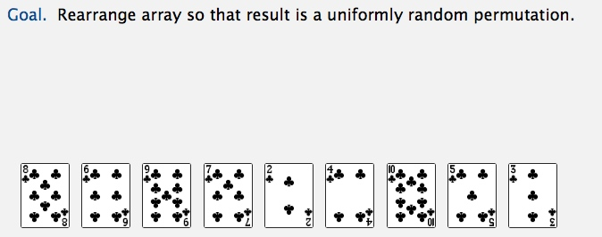

**Shuffle sort** 
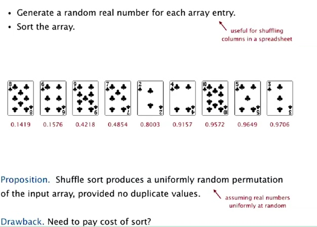

**Knuth shuffle** 
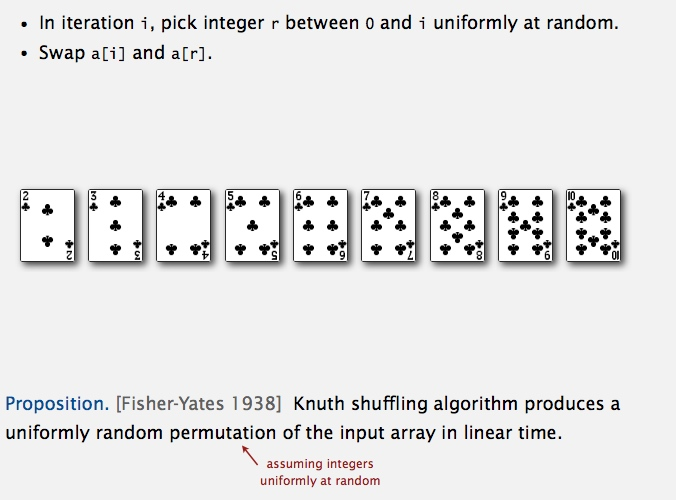 
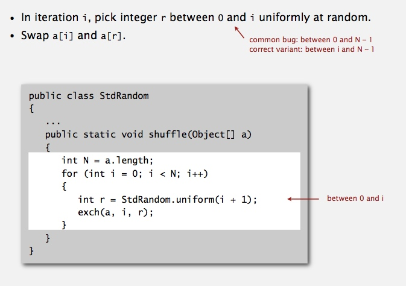

**War story (online poker)** 
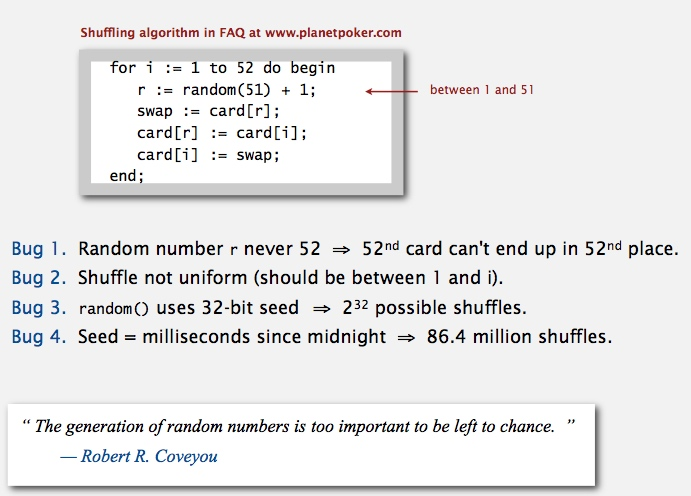

### Convex hull
[GrahamScan.java](../java/src/main/java/com/linbo/algs/examples/GrahamScan.java) 
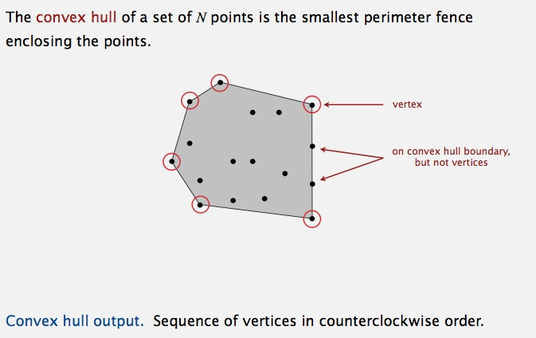

**Convex hull: mechanical algorithm** 
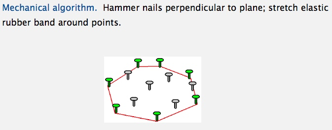

**Convex hull application: motion planning** 
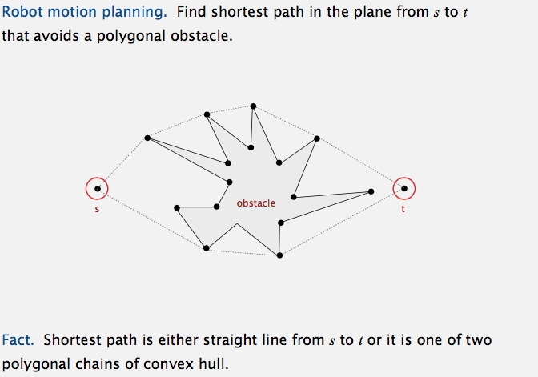

**Convex hull application: farthest pair** 
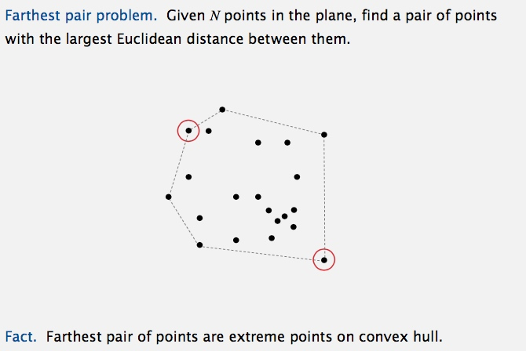

**Convex hull: geometric properties** 
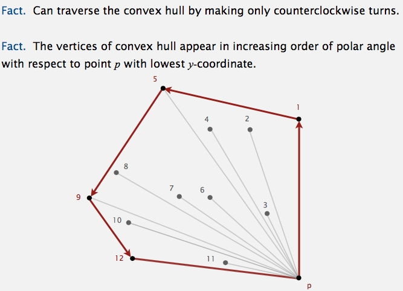

**Graham scan demo** 
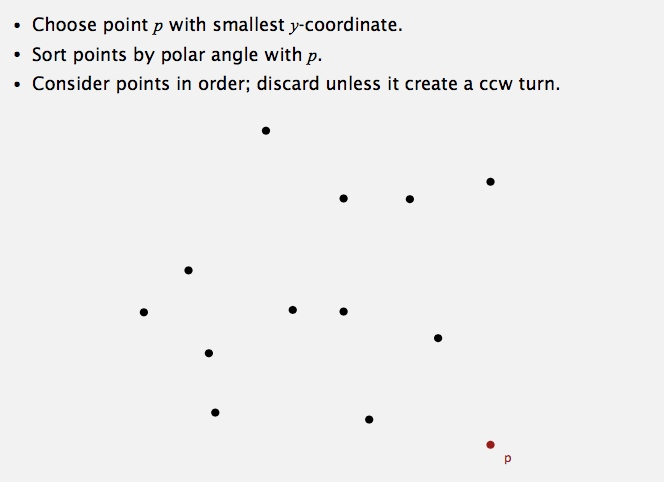 
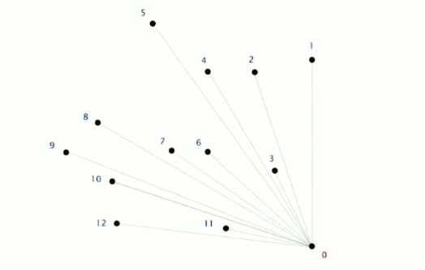 
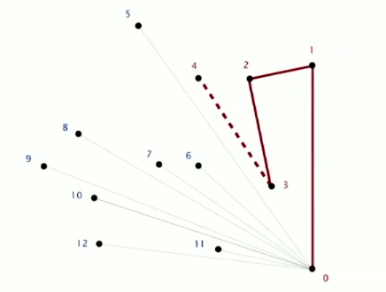 
 
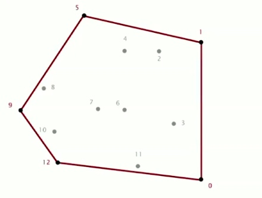 

**Graham scan: implementation challenges** 
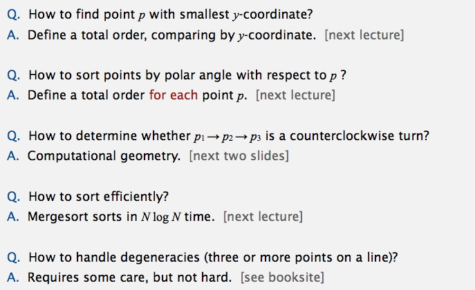

**When we have a good sorting algorithm, it gives us a good convex hull algorithm. Because the most work in convex hull is the sort.**

**Implementing ccw** 
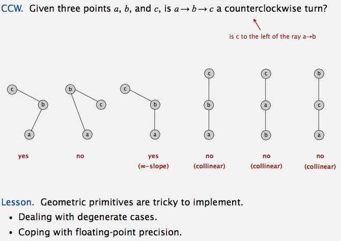
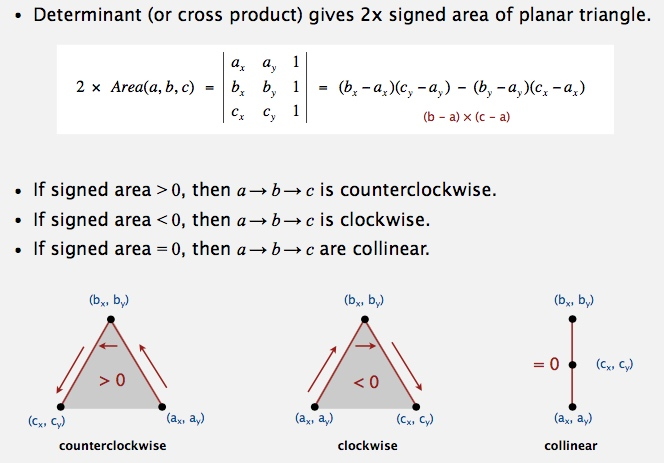

**Immutable point data type** 
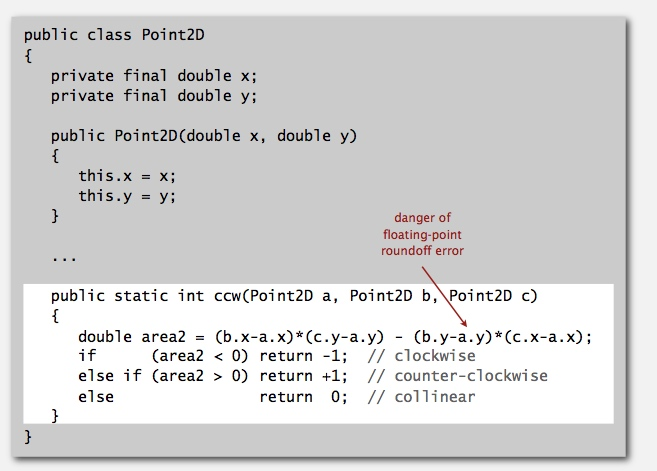

