# Elementary Sorts

## Sorting problem
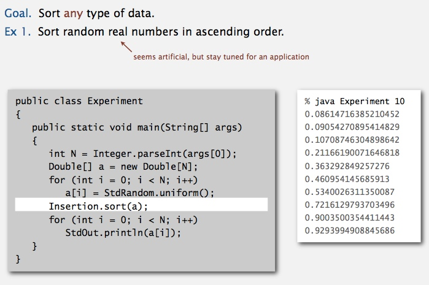
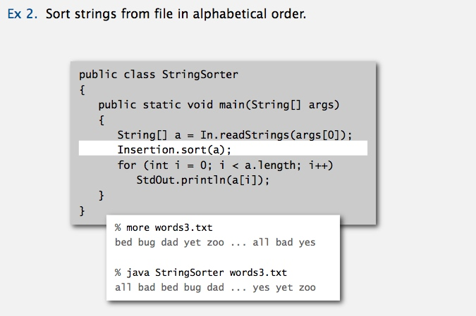
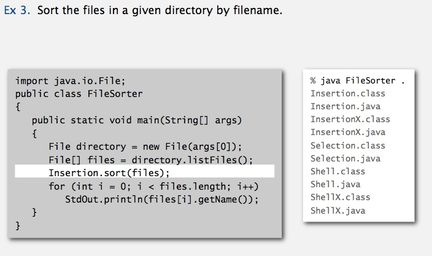

**Callbacks** 
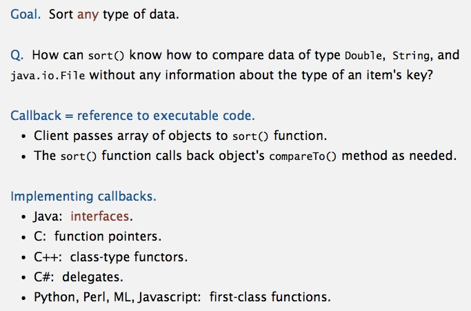
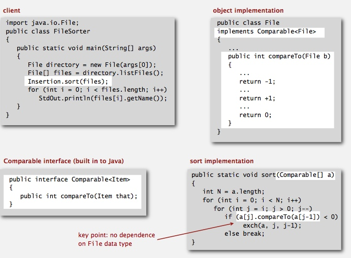

**Total order** 
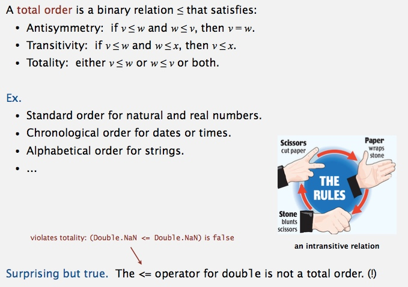

**Implementing the Comparable interface** 
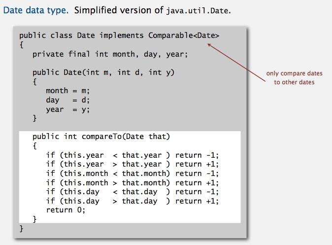

**Two useful sorting abstractions** 
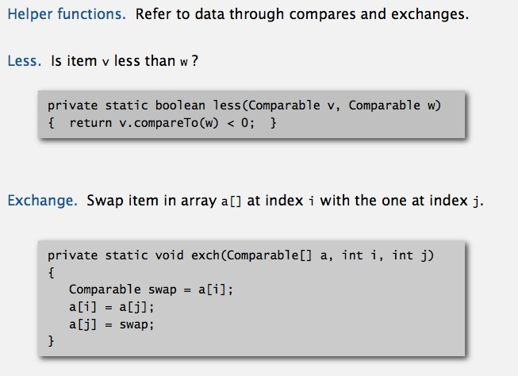
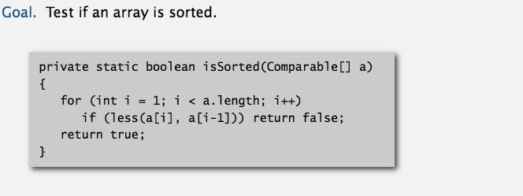

------------------------------------------------------------------

## Selection sort
[Selection.java](../java/src/main/java/com/linbo/algs/sortings/Selection.java) 
**animation** 
 
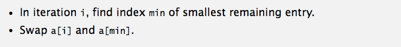
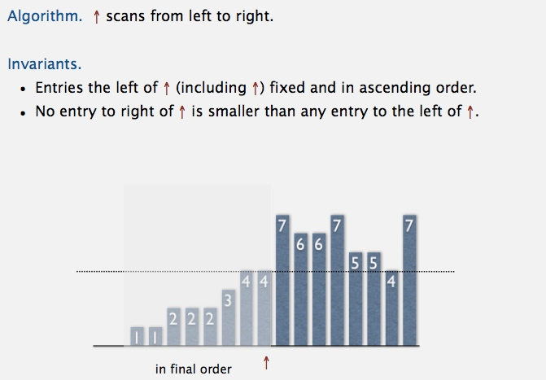

**Selection sort inner loop** 
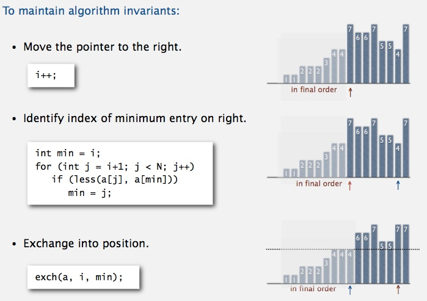

**Java implementation** 

**mathematical analysis** 
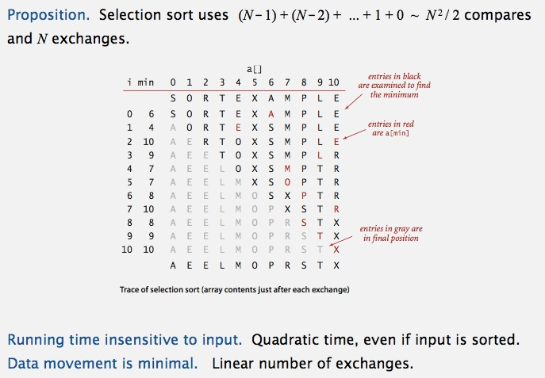

------------------------------------------------------------------------

## Insertion sort
[Insertion.java](../java/src/main/java/com/linbo/algs/sortings/Insertion.java) 
**animation** 

 

**Insertion sort inner loop** 
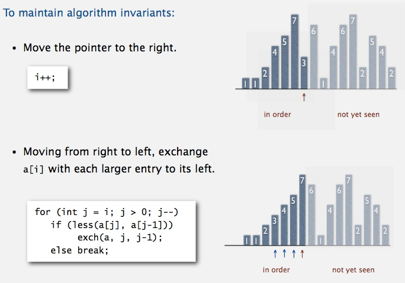

**Java implementation** 
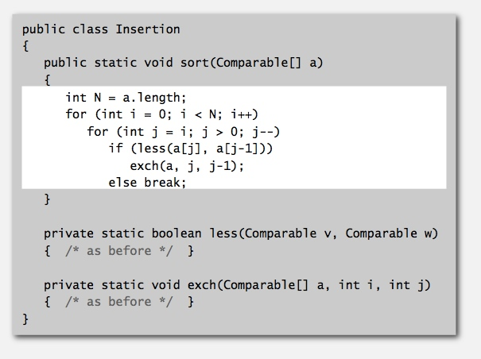

**mathematical analysis** 
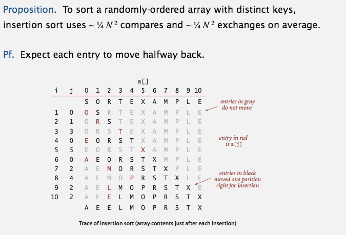

**best and worst case** 
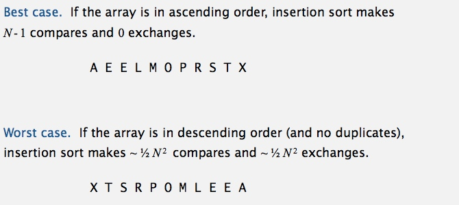

**partially-sorted arrays** 
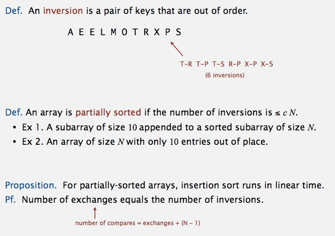

------------------------------------------------------------------------

## Shell sort
[Shell.java](../java/src/main/java/com/linbo/algs/sortings/Shell.java) 
**animation** 

 
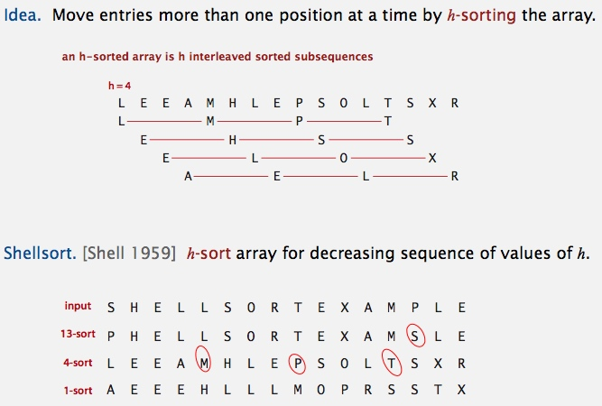

**h-sorting** 
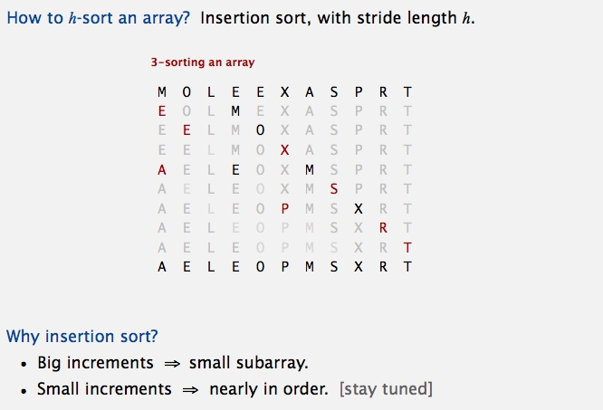

**Shellsort example: increments 7, 3, 1** 
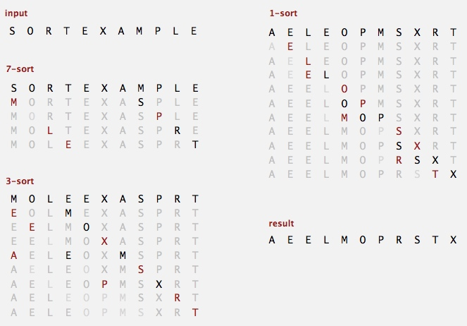

**Shellsort: intuition** 
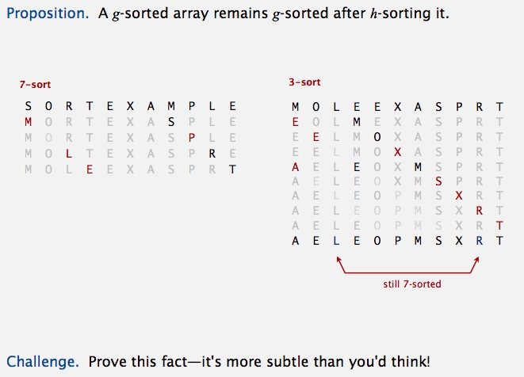

**Shellsort: which increment sequence to use?** 
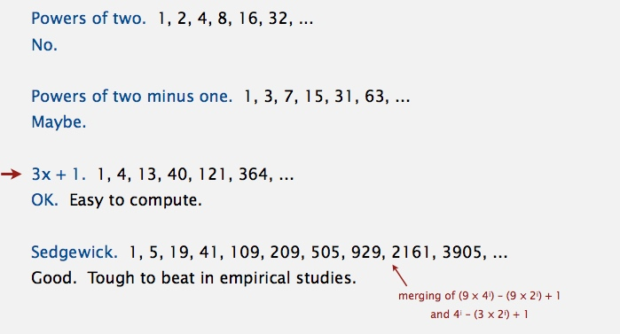

**Shellsort: Java implementation** 
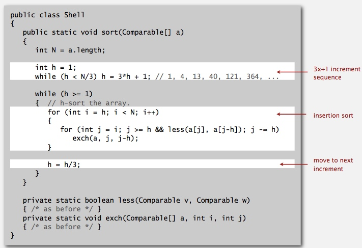

**Shellsort: visual trace** 
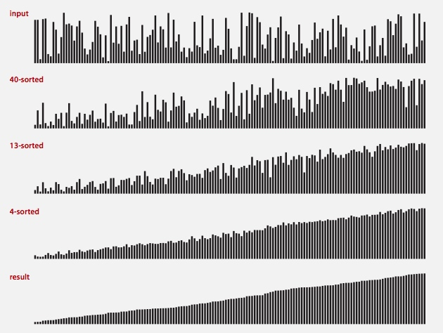

**Shellsort: analysis**
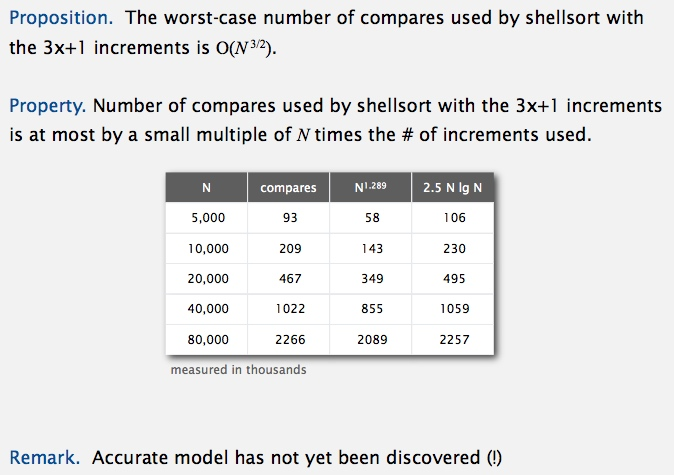

**Why are we interested in shellsort?** 
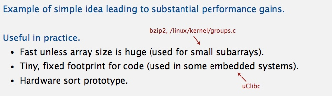

