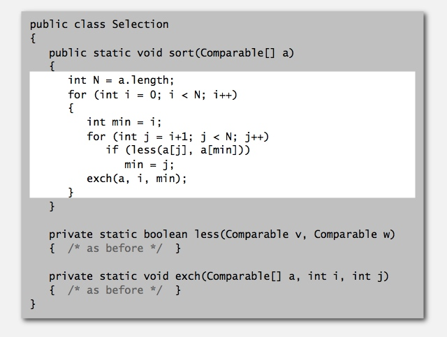

# Elementary Sorts

## Sorting problem

**Callbacks** 

**Total order** 

**Implementing the Comparable interface** 

**Two useful sorting abstractions** 

------------------------------------------------------------------

## Selection sort
[Selection.java](../java/src/main/java/com/linbo/algs/sortings/Selection.java) 
**animation** 
 

**Selection sort inner loop** 

**Java implementation** 

**mathematical analysis** 

------------------------------------------------------------------------

## Insertion sort
[Insertion.java](../java/src/main/java/com/linbo/algs/sortings/Insertion.java) 
**animation** 

 

**Insertion sort inner loop** 

**Java implementation** 

**mathematical analysis** 

**best and worst case**

**partially-sorted arrays**

