# Mergesort

## Two classic sorting algorithms
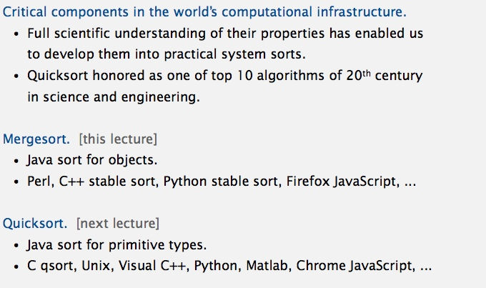

## Mergesort
[Merge.java](../java/src/main/java/com/linbo/algs/sortings/Merge.java) 
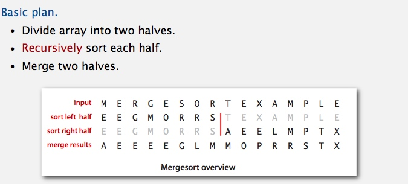

**Abstract in-place merge** 
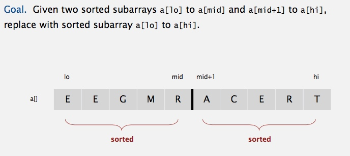

**Merging: Java implementation**
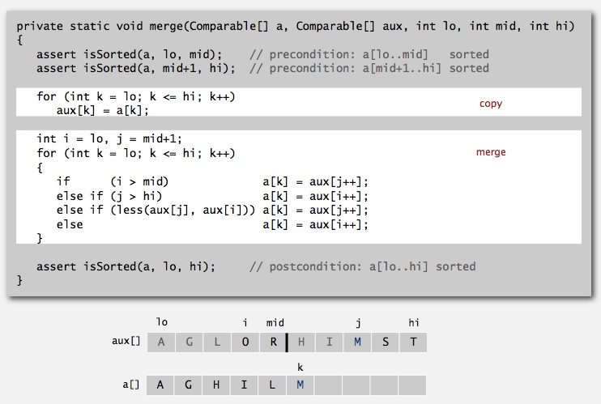

**Assertions** 
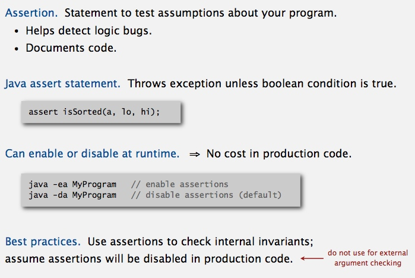

**Mergesort: Java implementation** 

### Trace and Animation
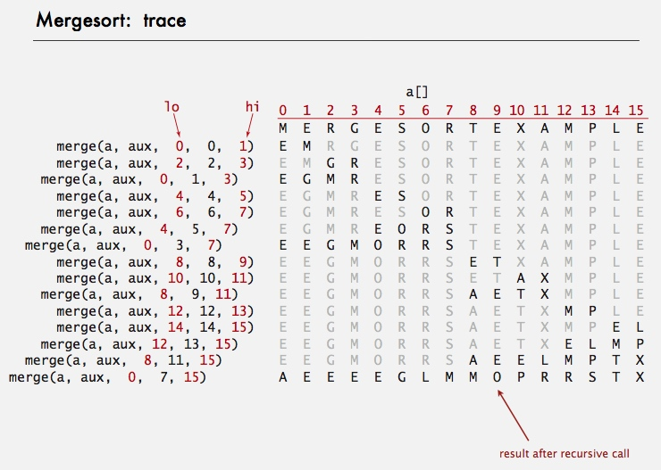

 

### Empirical analysis

### Mergesort: number of compares and array accesses
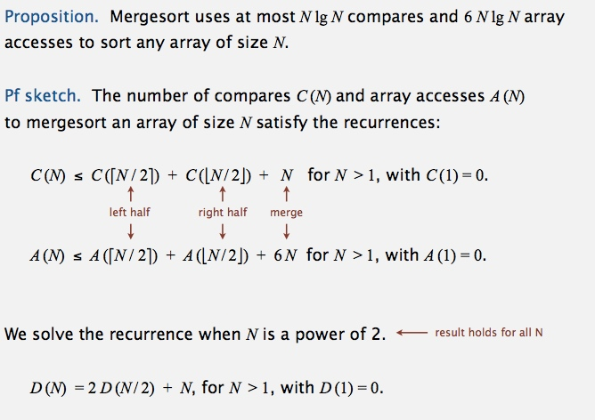

**Divide-and-conquer recurrence** 
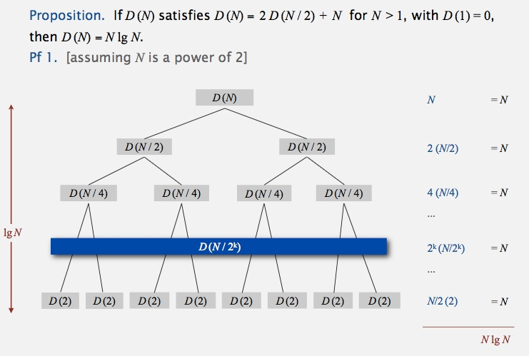
 
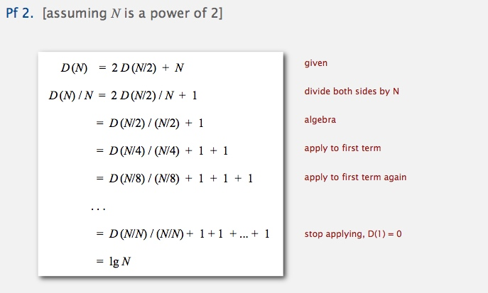 
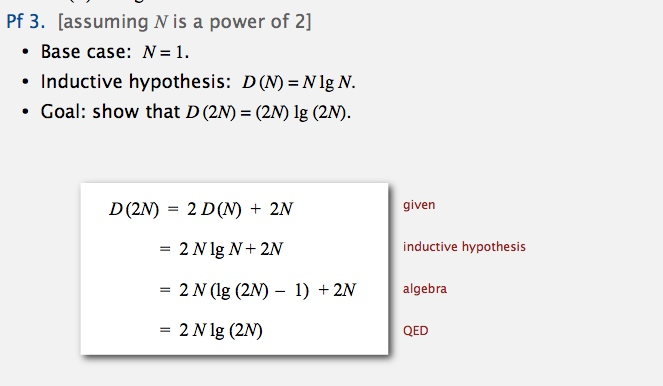

### Mergesort analysis: memory
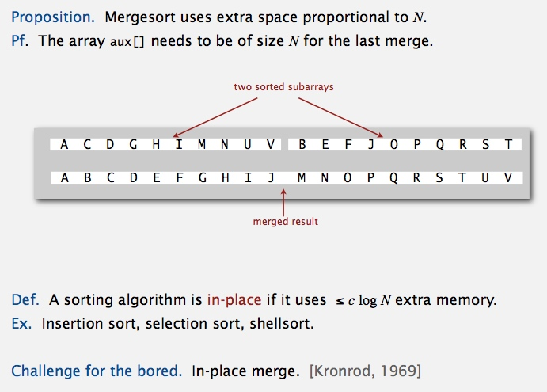

### Practical improvements
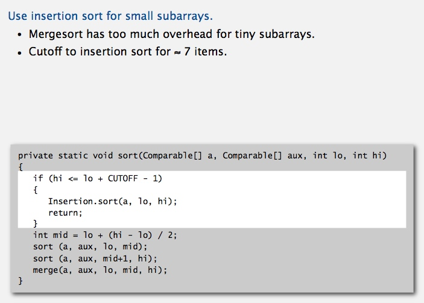 
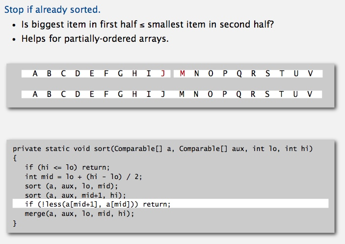 
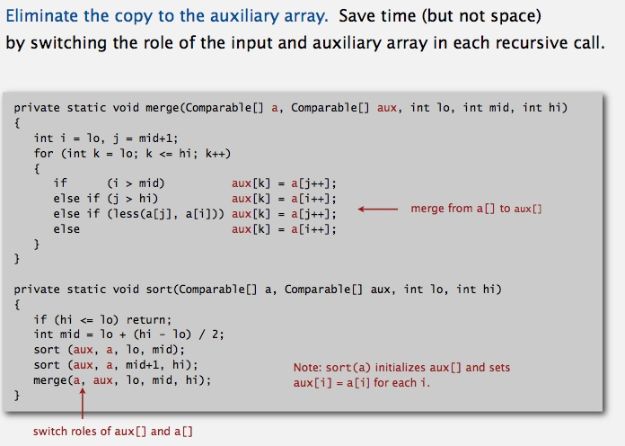

### visualization
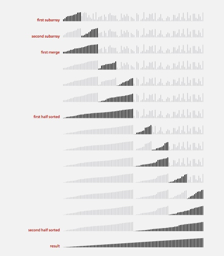

-------------------------------------------------

## Bottom-up mergesort
[MergeBU.java](../java/src/main/java/com/linbo/algs/sortings/MergeBU.java) 
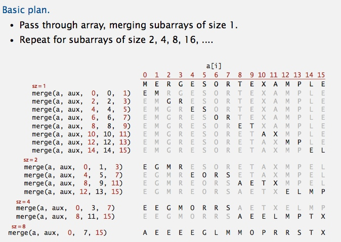
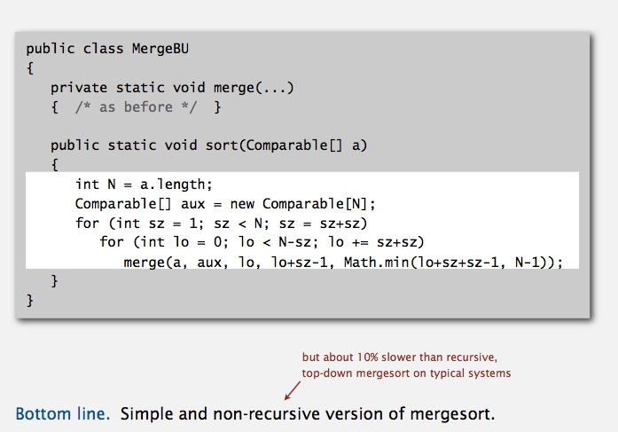

