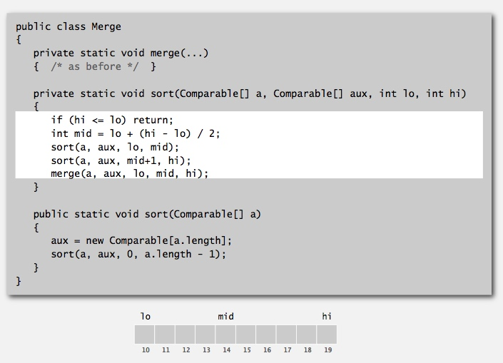
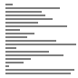
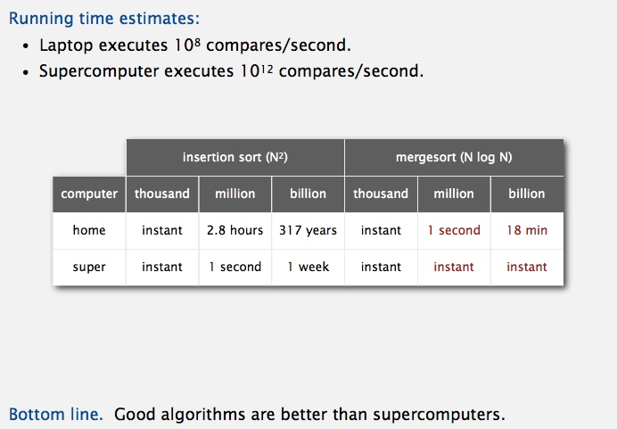
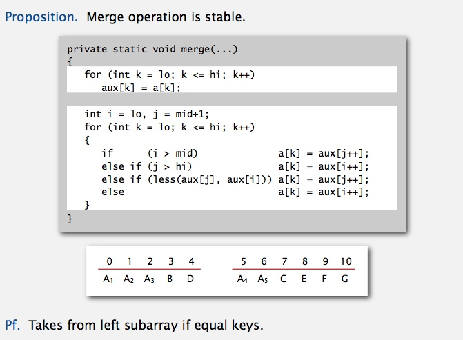

# Mergesort
Table of Contents
=================

   * [Mergesort](#mergesort)
      * [Two classic sorting algorithms](#two-classic-sorting-algorithms)
      * [Mergesort](#mergesort-1)
         * [Trace and Animation](#trace-and-animation)
         * [Empirical analysis](#empirical-analysis)
         * [Mergesort: number of compares and array accesses](#mergesort-number-of-compares-and-array-accesses)
         * [Mergesort analysis: memory](#mergesort-analysis-memory)
         * [Practical improvements](#practical-improvements)
         * [visualization](#visualization)
      * [Bottom-up mergesort](#bottom-up-mergesort)
      * [Sorting complexity](#sorting-complexity)
         * [Compare-based lower bound for sorting](#compare-based-lower-bound-for-sorting)
         * [Complexity results in context](#complexity-results-in-context)
      * [comparators](#comparators)
         * [Comparator interface](#comparator-interface)
         * [Comparator interface: implementing](#comparator-interface-implementing)
         * [Polar order](#polar-order)
      * [stability](#stability)
         * [Stability: insertion sort](#stability-insertion-sort)
         * [Stability: selection sort](#stability-selection-sort)
         * [Stability: shellsort](#stability-shellsort)
         * [Stability: mergesort](#stability-mergesort)
        
## Two classic sorting algorithms

## Mergesort
[Merge.java](../java/src/main/java/com/linbo/algs/sortings/Merge.java) 

**Abstract in-place merge** 

**Merging: Java implementation**

**Assertions** 

**Mergesort: Java implementation** 

### Trace and Animation

 

### Empirical analysis

### Mergesort: number of compares and array accesses

**Divide-and-conquer recurrence** 

 
 


### Mergesort analysis: memory

### Practical improvements
 
 

### visualization

-------------------------------------------------

## Bottom-up mergesort
[MergeBU.java](../java/src/main/java/com/linbo/algs/sortings/MergeBU.java) 

-------------------------------------------------

## Sorting complexity

**Decision tree (for 3 distinct items a, b, and c)** 

### Compare-based lower bound for sorting
 

**Complexity of sorting** 

### Complexity results in context

------------------------------------------

## comparators

### Comparator interface

**Comparator interface: system sort** 

**Comparator interface: using with our sorting libraries** 

### Comparator interface: implementing
 

### Polar order
[Point2D.java](../java/src/main/java/com/linbo/algs/examples/Point2D.java) 

**Comparator interface: polar order** 

-------------------------------------------------------------------

## stability
 

### Stability: insertion sort

### Stability: selection sort

### Stability: shellsort

### Stability: mergesort
 

