# Priority Queues
Table of Contents
=================

   * [Priority Queues](#priority-queues)
      * [API and elementary implementations](#api-and-elementary-implementations)
         * [Priority queue client example](#priority-queue-client-example)
         * [Priority queue: unordered and ordered array implementation](#priority-queue-unordered-and-ordered-array-implementation)
      * [Binary Heaps](#binary-heaps)
         * [Complete binary tree](#complete-binary-tree)
         * [Binary heap representations](#binary-heap-representations)
         * [Binary heap properties](#binary-heap-properties)
         * [Promotion in a heap](#promotion-in-a-heap)
         * [Insertion in a heap](#insertion-in-a-heap)
         * [Demotion in a heap](#demotion-in-a-heap)
         * [Delete the maximum in a heap](#delete-the-maximum-in-a-heap)
         * [Binary heap demo](#binary-heap-demo)
         * [Binary heap: Java implementation](#binary-heap-java-implementation)
         * [Priority queues implementation cost summary](#priority-queues-implementation-cost-summary)
         * [Binary heap considerations](#binary-heap-considerations)
         * [Immutability: implementing in Java](#immutability-implementing-in-java)
         * [Immutability: properties](#immutability-properties)
      * [Heapsort](#heapsort)
         * [Heapsort Demo](#heapsort-demo)
         * [Heapsort: heap construction](#heapsort-heap-construction)
         * [Heapsort: sortdown](#heapsort-sortdown)
         * [Heapsort: Java implementation](#heapsort-java-implementation)
         * [Heapsort: trace and animation](#heapsort-trace-and-animation)
         * [Heapsort: mathematical analysis](#heapsort-mathematical-analysis)
         * [Sorting algorithms: summary](#sorting-algorithms-summary)
      * [event-driven simulation](#event-driven-simulation)
         * [Molecular dynamics simulation of hard discs](#molecular-dynamics-simulation-of-hard-discs)
         
## API and elementary implementations
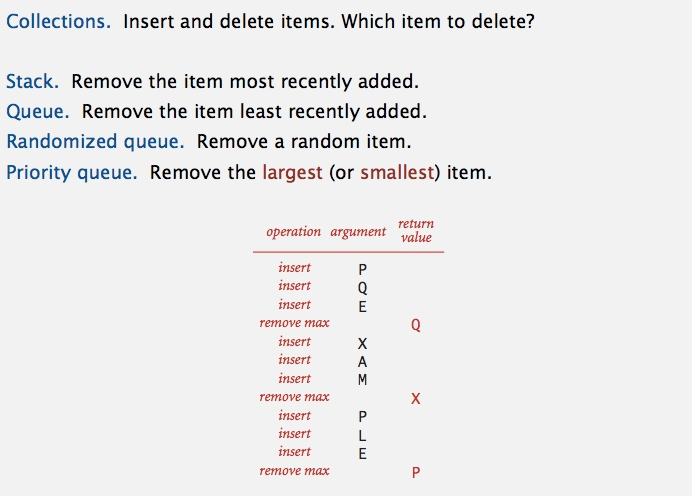

**Priority queue API** 
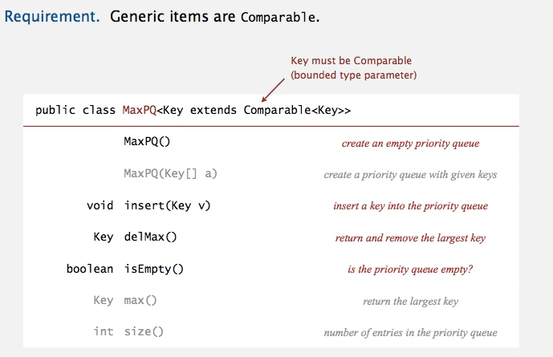

**Priority queue applications** 
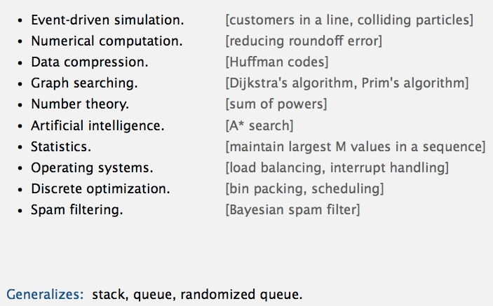

### Priority queue client example
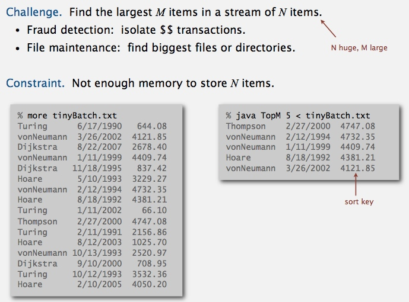 
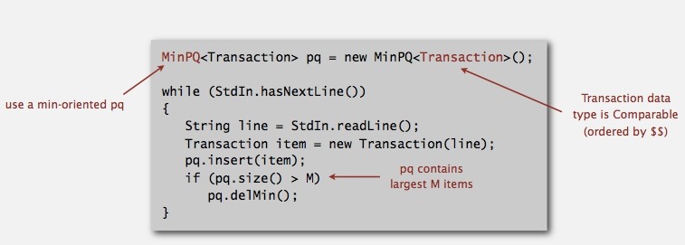 
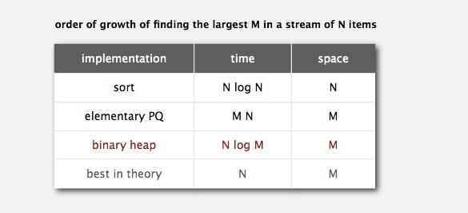

### Priority queue: unordered and ordered array implementation
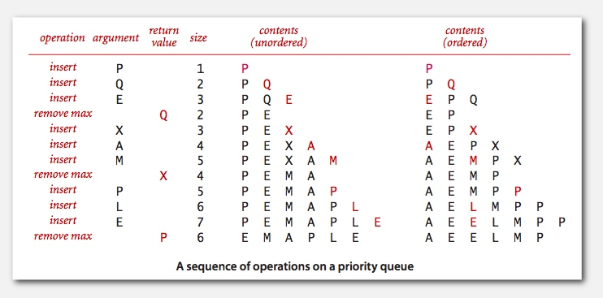

**unordered array implementation** 
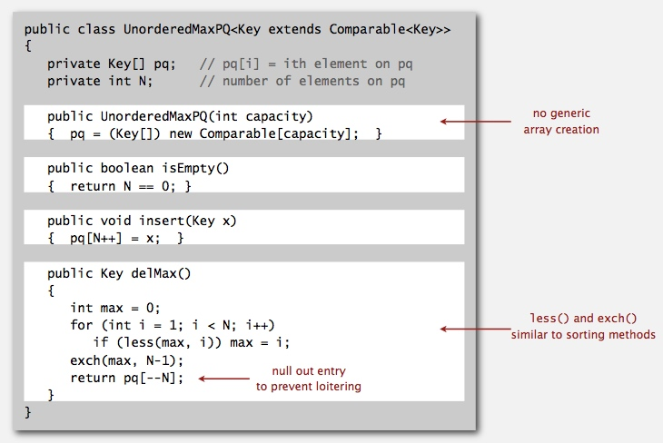

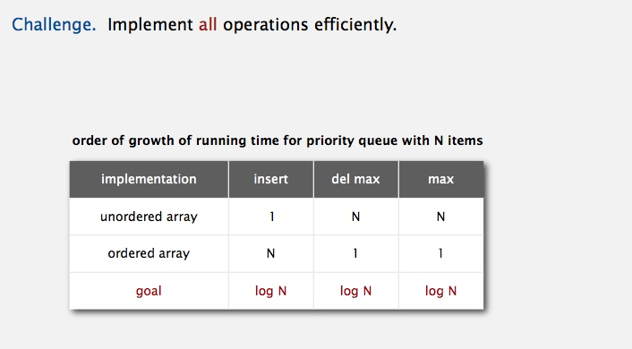

--------------------------------------------------------------------

## Binary Heaps
### Complete binary tree
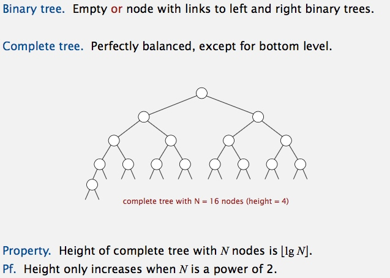

### Binary heap representations
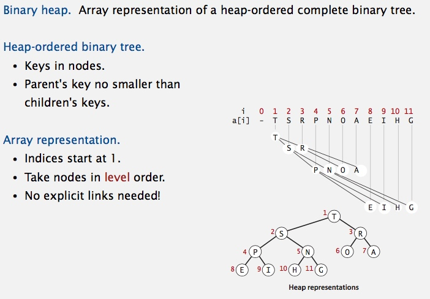

### Binary heap properties
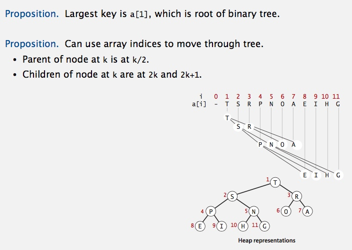

### Promotion in a heap
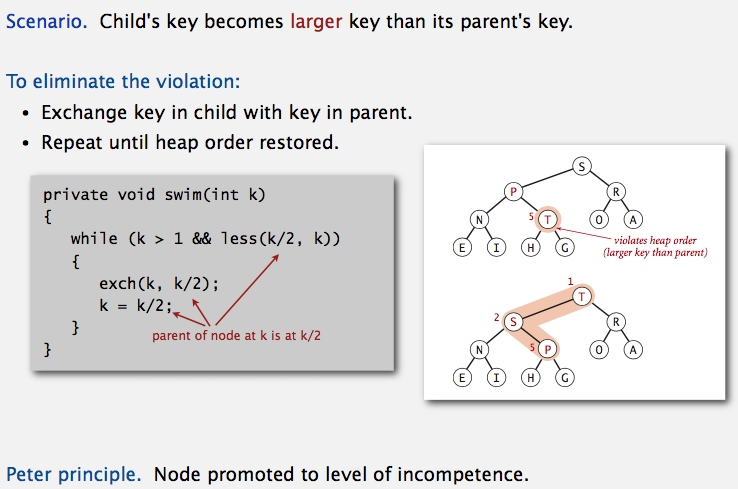

### Insertion in a heap
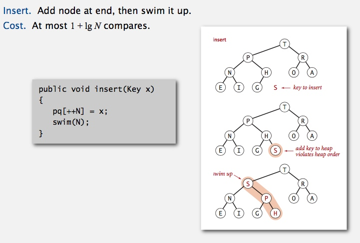

### Demotion in a heap
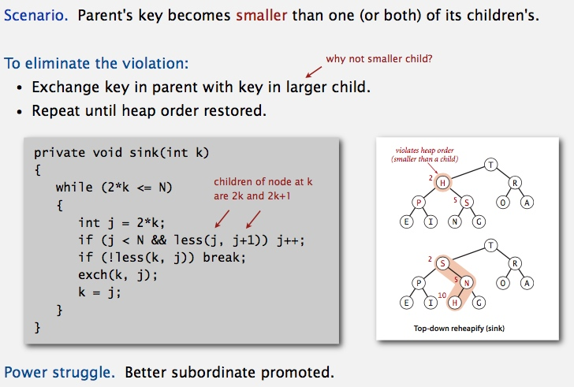

### Delete the maximum in a heap
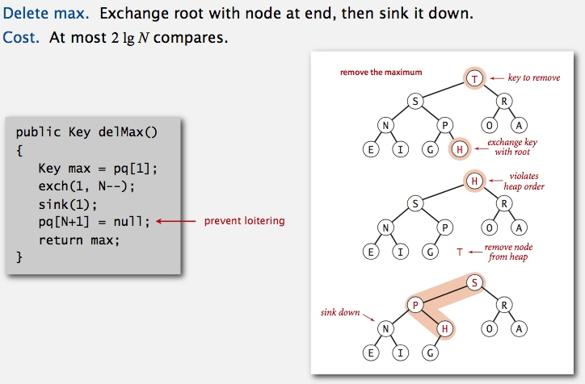

### Binary heap demo
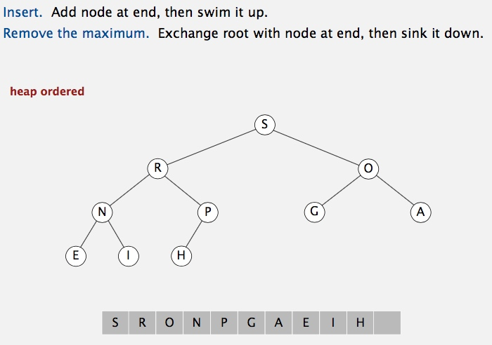

### Binary heap: Java implementation
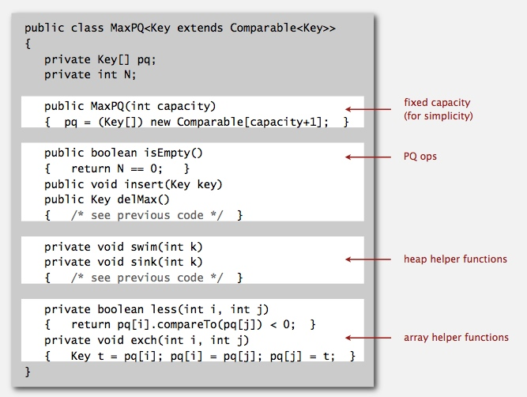

### Priority queues implementation cost summary
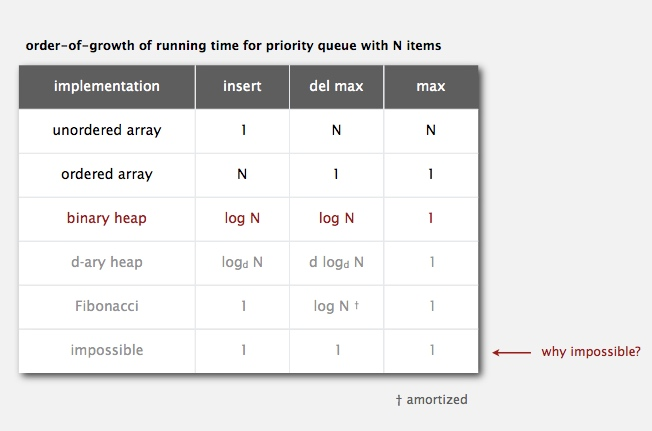

### Binary heap considerations
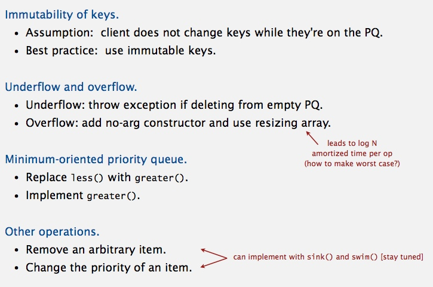

### Immutability: implementing in Java
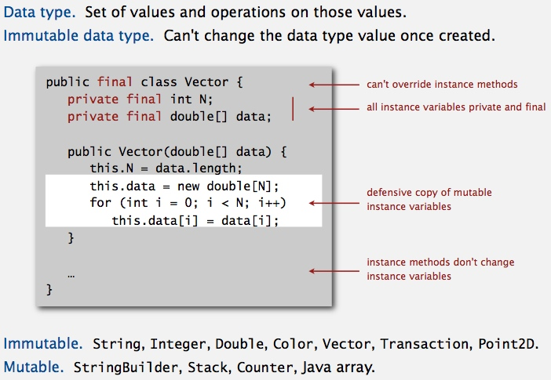

### Immutability: properties
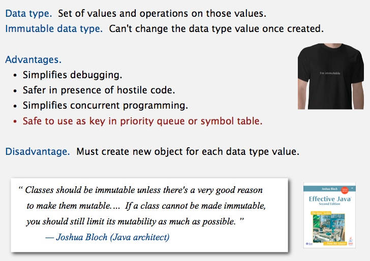

-------------------------------------------------------------

## Heapsort
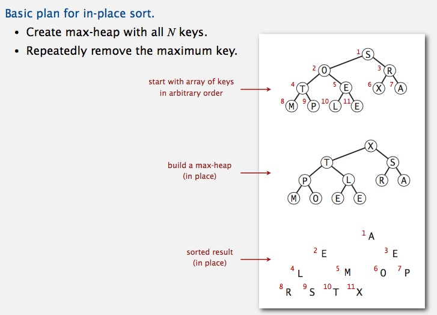

### Heapsort Demo
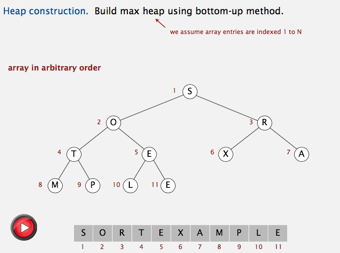 
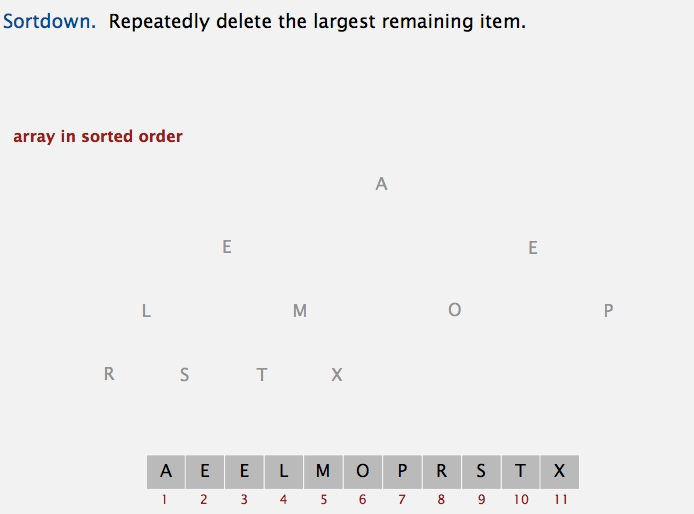

### Heapsort: heap construction
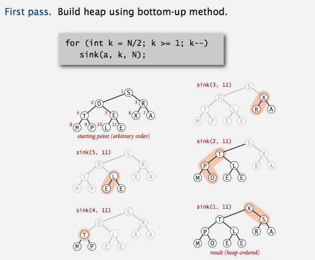

### Heapsort: sortdown
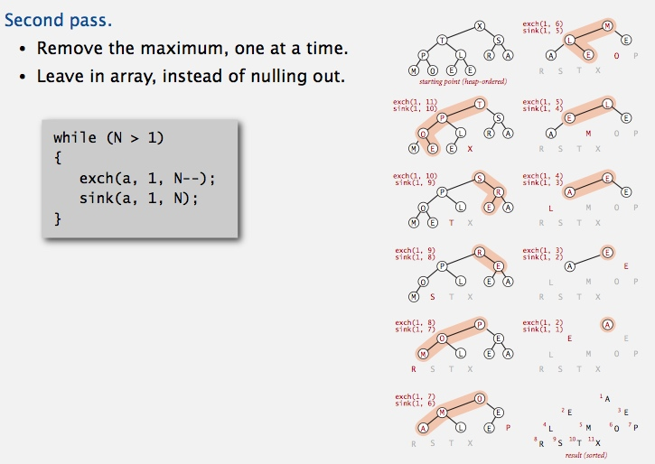

### Heapsort: Java implementation
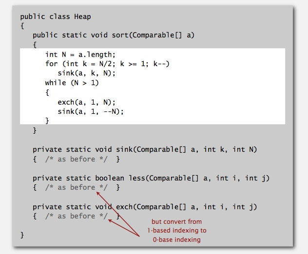

### Heapsort: trace and animation
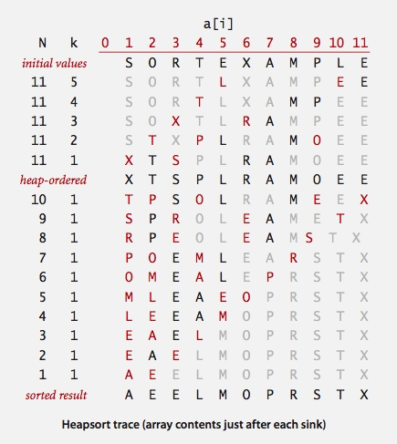

### Heapsort: mathematical analysis
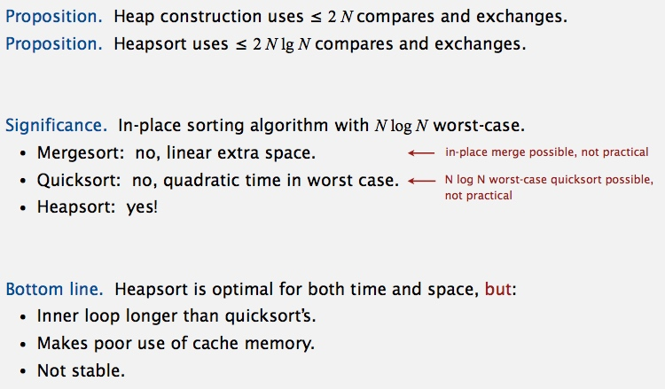

### Sorting algorithms: summary

----------------------------------------------------

##  event-driven simulation
### Molecular dynamics simulation of hard discs
[CollisionSystem.java](https://github.com/kevin-wayne/algs4/blob/master/src/main/java/edu/princeton/cs/algs4/CollisionSystem.java)
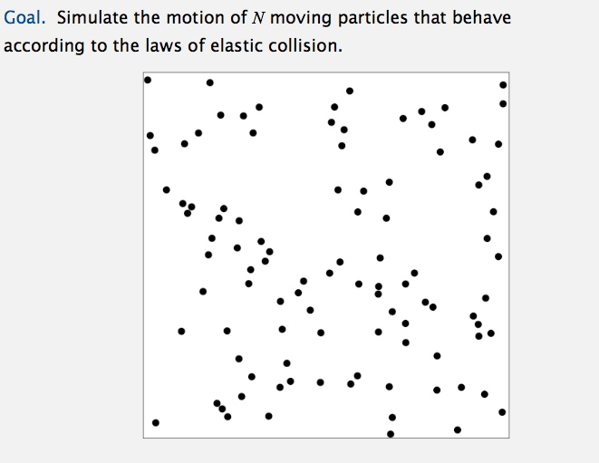

