# Symbol Tables
Table of Contents
=================

   * [Symbol Tables](#symbol-tables)
      * [API](#api)
         * [Basic symbol table API](#basic-symbol-table-api)
         * [Conventions](#conventions)
         * [Keys and values](#keys-and-values)
         * [Equality test](#equality-test)
         * [Implementing equals for user-defined types](#implementing-equals-for-user-defined-types)
         * [ST test client for traces](#st-test-client-for-traces)
         * [ST test client for analysis](#st-test-client-for-analysis)
      * [Elementary Implementations](#elementary-implementations)
         * [Sequential search in a linked list](#sequential-search-in-a-linked-list)
         * [Binary search in an ordered array](#binary-search-in-an-ordered-array)
         * [Binary search: Java implementation](#binary-search-java-implementation)
         * [Binary search: trace of standard indexing client](#binary-search-trace-of-standard-indexing-client)
         * [Elementary ST implementations:](#elementary-st-implementations)
      * [Ordered operations](#ordered-operations)
         * [Ordered symbol table API](#ordered-symbol-table-api)
         * [Binary search: ordered symbol table operations summary](#binary-search-ordered-symbol-table-operations-summary)
         
## API
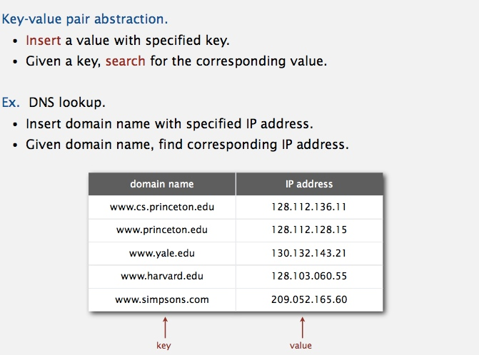

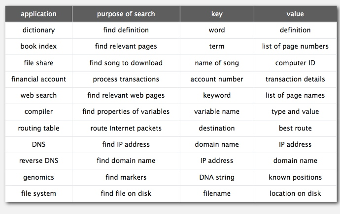

### Basic symbol table API
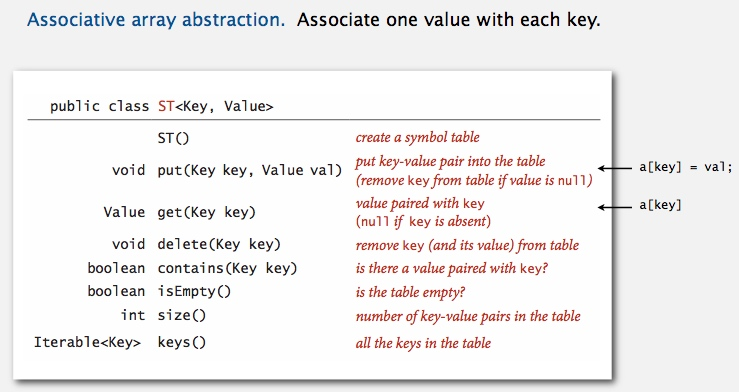

### Conventions
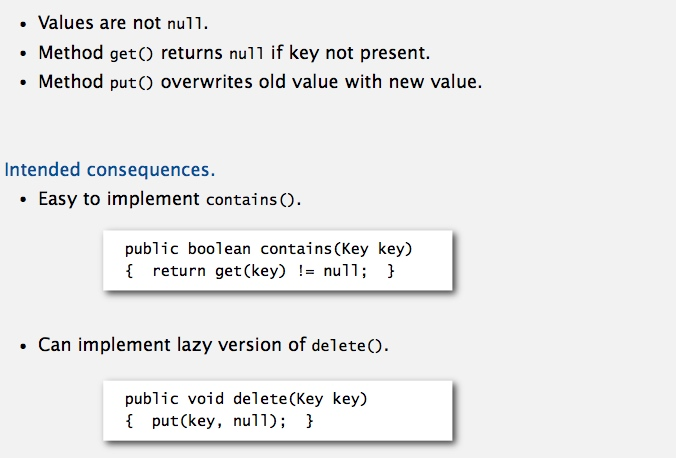

### Keys and values
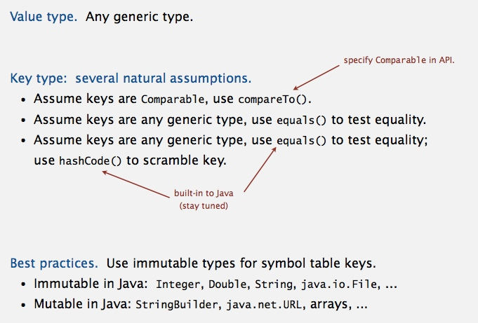

### Equality test
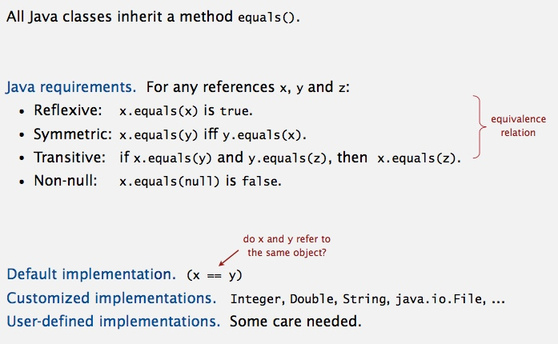

### Implementing equals for user-defined types
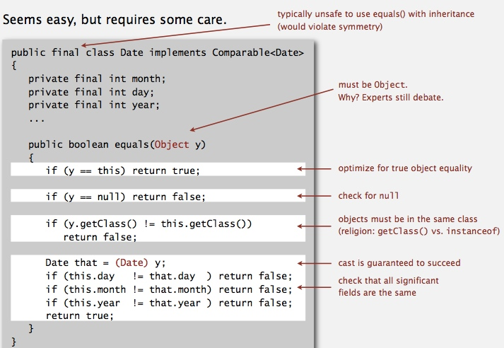 
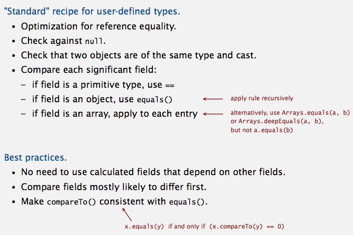

### ST test client for traces
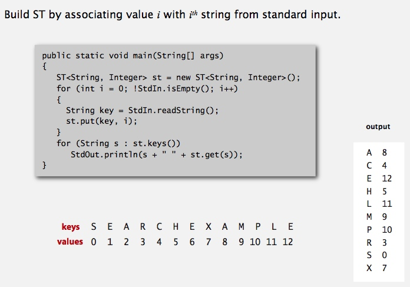

### ST test client for analysis
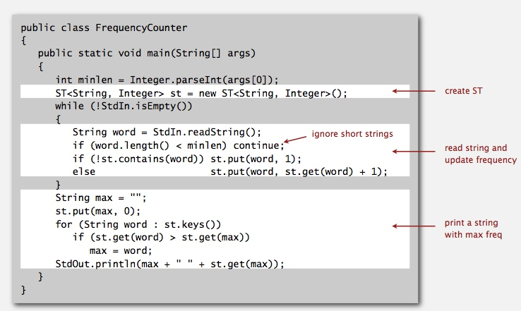 
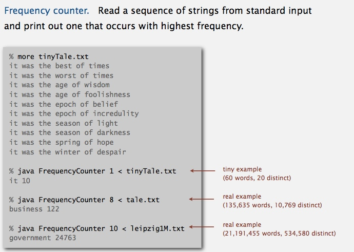

## Elementary Implementations
### Sequential search in a linked list
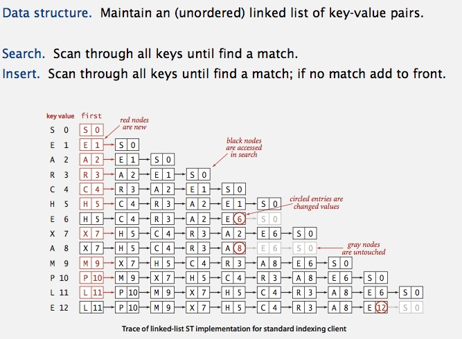

### Binary search in an ordered array
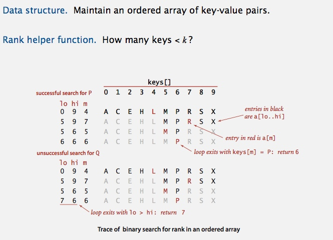

### Binary search: Java implementation
[BinarySearchST.java](../java/src/main/java/com/linbo/algs/datatypes/BinarySearchST.java) 
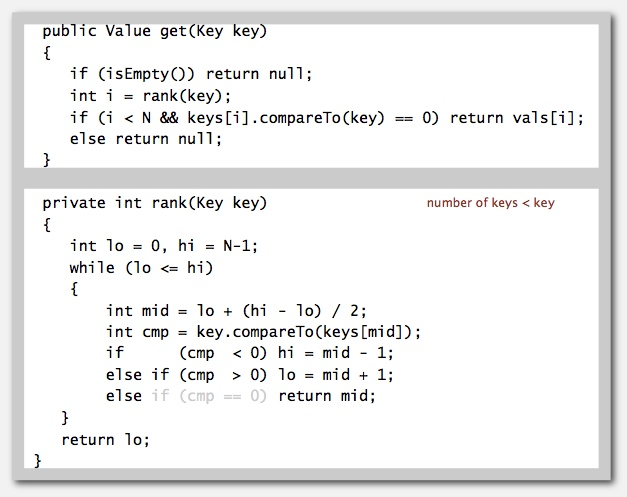

### Binary search: trace of standard indexing client
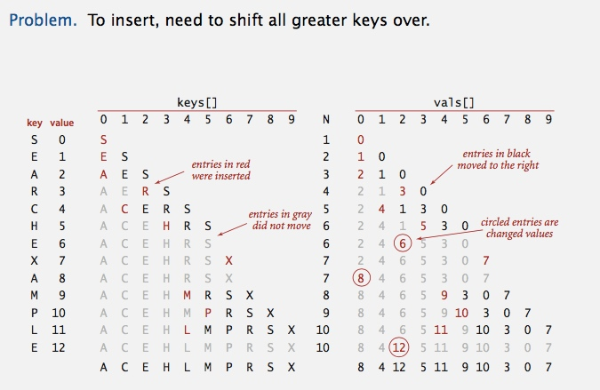

### Elementary ST implementations:
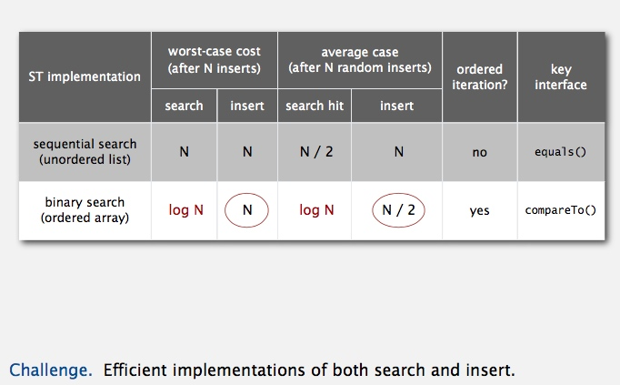

## Ordered operations  
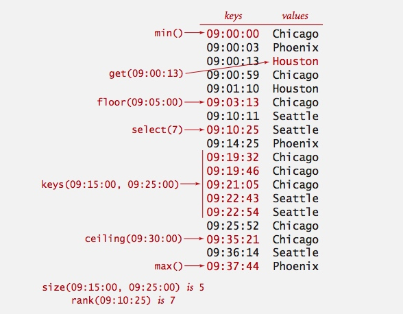

### Ordered symbol table API
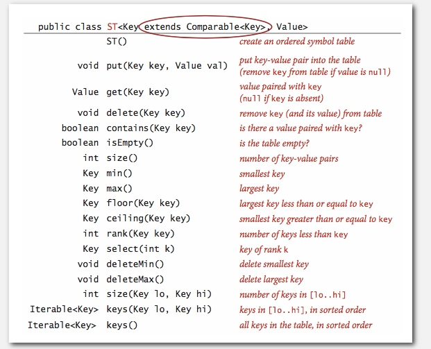

### Binary search: ordered symbol table operations summary
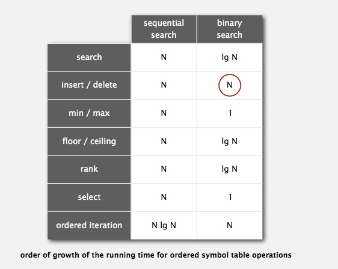

