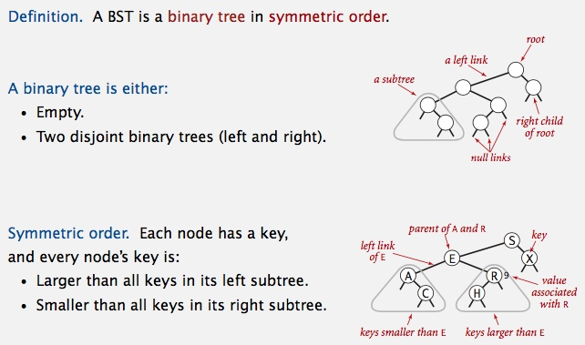
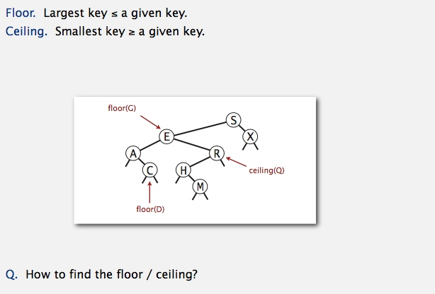
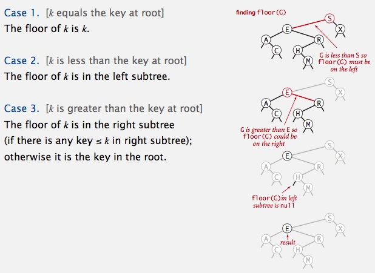

# Binary Search Tree
Table of Contents
=================

   * [Binary Search Tree](#binary-search-tree)
      * [BSTs](#bsts)
         * [Binary search tree demo](#binary-search-tree-demo)
         * [BST search: Java implementation](#bst-search-java-implementation)
         * [BST insert](#bst-insert)
         * [Tree shape](#tree-shape)
         * [BSTs: mathematical analysis](#bsts-mathematical-analysis)
         * [ST implementations: summary](#st-implementations-summary)
      * [Ordered operations](#ordered-operations)
         * [Minimum and maximum](#minimum-and-maximum)
         * [Floor and ceiling](#floor-and-ceiling)
         * [Subtree counts](#subtree-counts)
         * [Rank](#rank)
         * [Inorder traversal](#inorder-traversal)
         * [BST: ordered symbol table operations summary](#bst-ordered-symbol-table-operations-summary)
      * [deletion](#deletion)
         * [ST implementations: summary](#st-implementations-summary-1)
         * [Deleting the minimum](#deleting-the-minimum)
         * [Hibbard deletion](#hibbard-deletion)
         * [Hibbard deletion: Java implementation](#hibbard-deletion-java-implementation)
         * [Hibbard deletion: analysis](#hibbard-deletion-analysis)
         * [ST implementations: summary](#st-implementations-summary-2)
         
## BSTs
[BST.java](../java/src/main/java/com/linbo/algs/datatypes/BST.java) 

### Binary search tree demo

### BST search: Java implementation

### BST insert

### Tree shape

**BST insertion: random order visualization** 

**Correspondence between BSTs and quicksort partitioning** 

### BSTs: mathematical analysis

### ST implementations: summary

--------------------------------------------------------------------

## Ordered operations
### Minimum and maximum

### Floor and ceiling

**Computing the floor** 

### Subtree counts

**BST implementation: subtree counts** 

### Rank

### Inorder traversal

### BST: ordered symbol table operations summary

--------------------------------------------------------

## deletion
### ST implementations: summary

### Deleting the minimum

### Hibbard deletion
 
 

### Hibbard deletion: Java implementation

### Hibbard deletion: analysis

### ST implementations: summary

