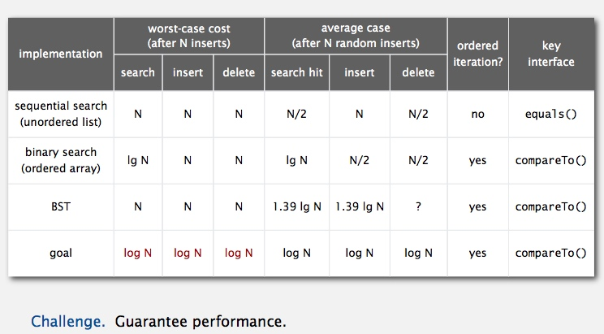
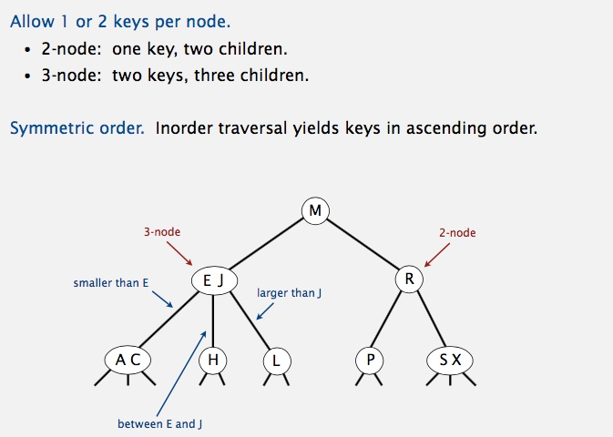
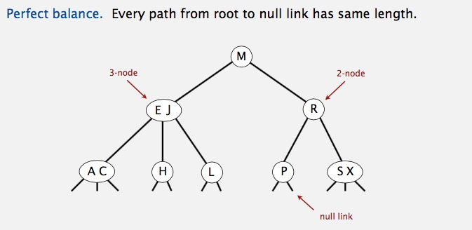
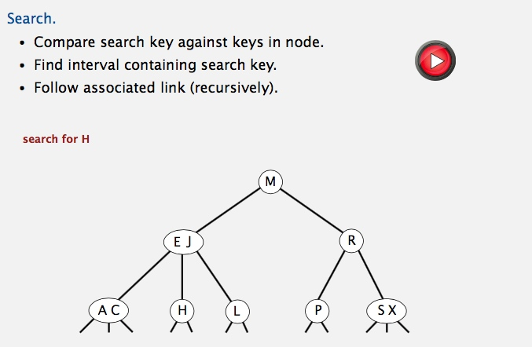
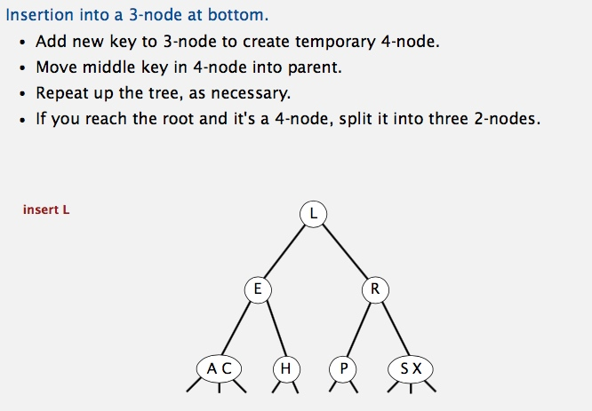
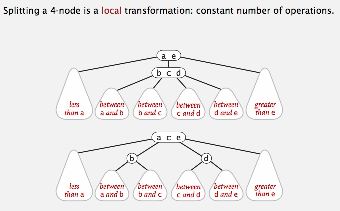
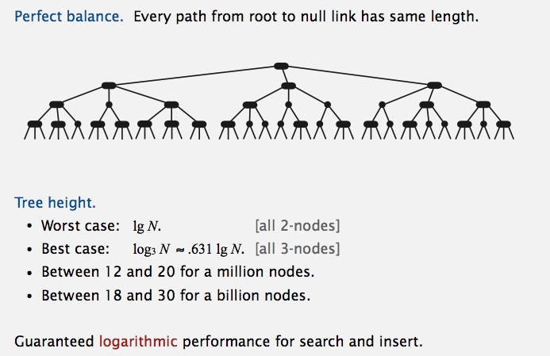
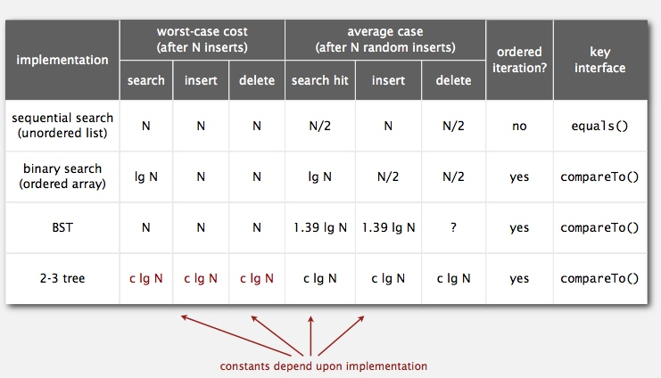
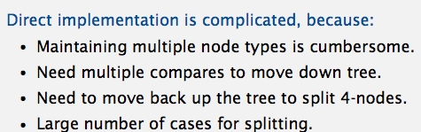

# Balanced Search Trees

## Symbol Table Review

## 2-3 search trees
 

### 2-3 tree demo

### Local transformations in a 2-3 tree

### Global properties in a 2-3 tree

### 2-3 tree: performance

### ST implementations: summary

### 2-3 tree: implementation?

