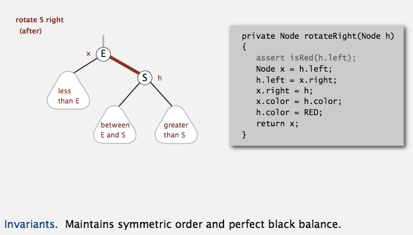

# Balanced Search Trees
Table of Contents
=================

   * [Balanced Search Trees](#balanced-search-trees)
      * [Symbol Table Review](#symbol-table-review)
      * [2-3 search trees](#2-3-search-trees)
         * [2-3 tree demo](#2-3-tree-demo)
         * [Local transformations in a 2-3 tree](#local-transformations-in-a-2-3-tree)
         * [Global properties in a 2-3 tree](#global-properties-in-a-2-3-tree)
         * [2-3 tree: performance](#2-3-tree-performance)
         * [ST implementations: summary](#st-implementations-summary)
         * [2-3 tree: implementation?](#2-3-tree-implementation)
      * [red-black BSTs](#red-black-bsts)
         * [Left-leaning red-black BSTs (Guibas-Sedgewick 1979 and Sedgewick 2007)](#left-leaning-red-black-bsts-guibas-sedgewick-1979-and-sedgewick-2007)
         * [Left-leaning red-black BSTs: 1-1 correspondence with 2-3 trees](#left-leaning-red-black-bsts-1-1-correspondence-with-2-3-trees)
         * [Search implementation for red-black BSTs](#search-implementation-for-red-black-bsts)
         * [Red-black BST representation](#red-black-bst-representation)
         * [Elementary red-black BST operations](#elementary-red-black-bst-operations)
            * [Left rotation](#left-rotation)
            * [Right rotation](#right-rotation)
            * [Color flip](#color-flip)
         * [Insertion in a LLRB tree](#insertion-in-a-llrb-tree)
            * [Warmup 1. Insert into a tree with exactly 1 node.](#warmup-1-insert-into-a-tree-with-exactly-1-node)
            * [Case 1. Insert into a 2-node at the bottom](#case-1-insert-into-a-2-node-at-the-bottom)
            * [Warmup 2. Insert into a tree with exactly 2 nodes.](#warmup-2-insert-into-a-tree-with-exactly-2-nodes)
            * [Case 2. Insert into a 3-node at the bottom.](#case-2-insert-into-a-3-node-at-the-bottom)
            * [passing red links up the tree](#passing-red-links-up-the-tree)
         * [Red-black BST construction demo](#red-black-bst-construction-demo)
         * [Java implementation](#java-implementation)
         * [visualization](#visualization)
         * [Balance in LLRB trees](#balance-in-llrb-trees)
         * [ST implementations: summary](#st-implementations-summary-1)
      * [B-trees](#b-trees)
         * [File system model](#file-system-model)
         * [B-trees (Bayer-McCreight, 1972)](#b-trees-bayer-mccreight-1972)
         * [Searching in a B-tree](#searching-in-a-b-tree)
         * [Insertion in a B-tree](#insertion-in-a-b-tree)
         * [Balance in B-tree](#balance-in-b-tree)
         * [Building a large B tree](#building-a-large-b-tree)
         * [Balanced trees in the wild](#balanced-trees-in-the-wild)
         
## Symbol Table Review

## 2-3 search trees
 

### 2-3 tree demo

### Local transformations in a 2-3 tree

### Global properties in a 2-3 tree

### 2-3 tree: performance

### ST implementations: summary

### 2-3 tree: implementation?

## red-black BSTs
[RedBlackBST.java](../java/src/main/java/com/linbo/algs/searchings/RedBlackBST.java) 
### Left-leaning red-black BSTs (Guibas-Sedgewick 1979 and Sedgewick 2007)

**An equivalent definition** 

### Left-leaning red-black BSTs: 1-1 correspondence with 2-3 trees

### Search implementation for red-black BSTs

### Red-black BST representation

### Elementary red-black BST operations
#### Left rotation
 

#### Right rotation
 

#### Color flip
 

### Insertion in a LLRB tree

#### Warmup 1. Insert into a tree with exactly 1 node.

#### Case 1. Insert into a 2-node at the bottom

#### Warmup 2. Insert into a tree with exactly 2 nodes.

#### Case 2. Insert into a 3-node at the bottom.

#### passing red links up the tree

### Red-black BST construction demo
[33DemoRedBlackBST.mov](media/33DemoRedBlackBST.mov)

### Java implementation

### visualization

### Balance in LLRB trees

### ST implementations: summary

 --------------------------------------------------------------
 
## B-trees
### File system model

### B-trees (Bayer-McCreight, 1972)

### Searching in a B-tree

### Insertion in a B-tree

### Balance in B-tree

### Building a large B tree

### Balanced trees in the wild

