# Hash Tables
Table of Contents
=================

   * [Hash Tables](#hash-tables)
      * [hash functions](#hash-functions)
         * [Computing the hash function](#computing-the-hash-function)
         * [Java’s hash code conventions](#javas-hash-code-conventions)
         * [Implementing hash code: integers, booleans, and doubles](#implementing-hash-code-integers-booleans-and-doubles)
         * [Implementing hash code: strings](#implementing-hash-code-strings)
         * [Implementing hash code: user-defined types](#implementing-hash-code-user-defined-types)
         * [Hash code design](#hash-code-design)
         * [Modular hashing](#modular-hashing)
         * [Uniform hashing assumption](#uniform-hashing-assumption)
      * [separate chaining](#separate-chaining)
         * [Collisions](#collisions)
         * [Separate chaining symbol table](#separate-chaining-symbol-table)
         * [Separate chaining ST: Java implementation](#separate-chaining-st-java-implementation)
         * [Analysis of separate chaining](#analysis-of-separate-chaining)
         * [ST implementations: summary](#st-implementations-summary)
      * [linear probing](#linear-probing)
         * [Collision resolution: open addressing](#collision-resolution-open-addressing)
         * [Linear probing hash table demo](#linear-probing-hash-table-demo)
         * [Linear probing hash table summary](#linear-probing-hash-table-summary)
         * [Linear probing ST implementation](#linear-probing-st-implementation)
         * [Clustering](#clustering)
         * [Knuth's parking problem](#knuths-parking-problem)
         * [Analysis of linear probing](#analysis-of-linear-probing)
         * [ST implementations: summary](#st-implementations-summary-1)
      * [context](#context)
         * [War story: String hashing in Java](#war-story-string-hashing-in-java)
         * [War story: algorithmic complexity attacks](#war-story-algorithmic-complexity-attacks)
         * [Diversion: one-way hash functions](#diversion-one-way-hash-functions)
         * [Separate chaining vs. linear probing](#separate-chaining-vs-linear-probing)
         * [Hashing: variations on the theme](#hashing-variations-on-the-theme)
         * [Hash tables vs. balanced search trees](#hash-tables-vs-balanced-search-trees)

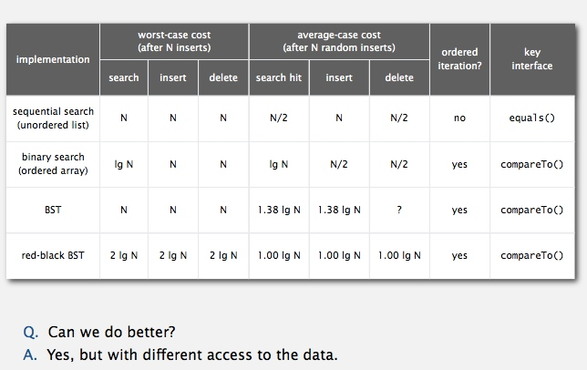

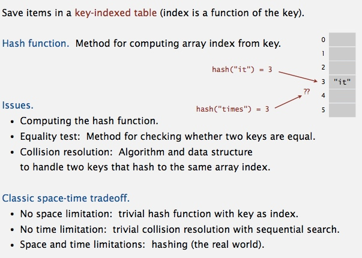

## hash functions
### Computing the hash function
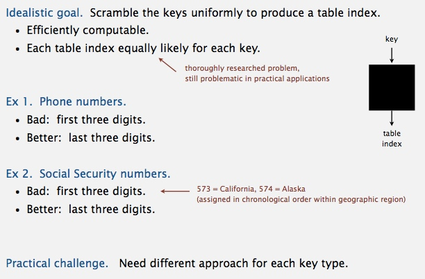

### Java’s hash code conventions
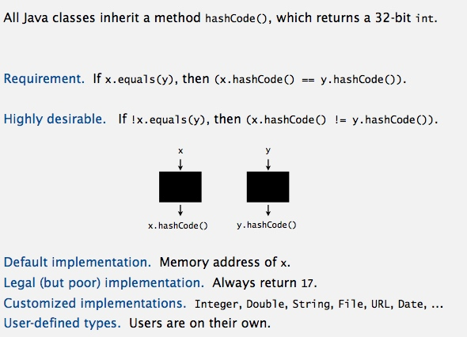

### Implementing hash code: integers, booleans, and doubles
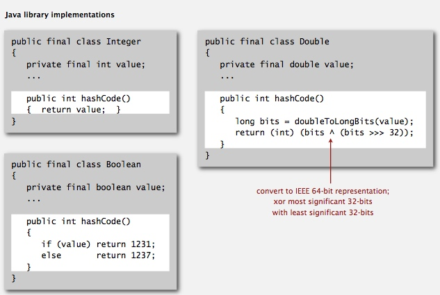

### Implementing hash code: strings
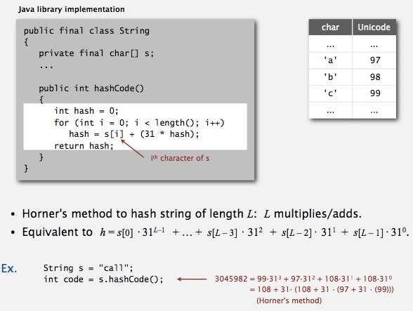

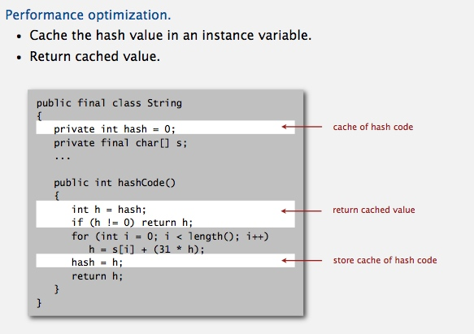

### Implementing hash code: user-defined types
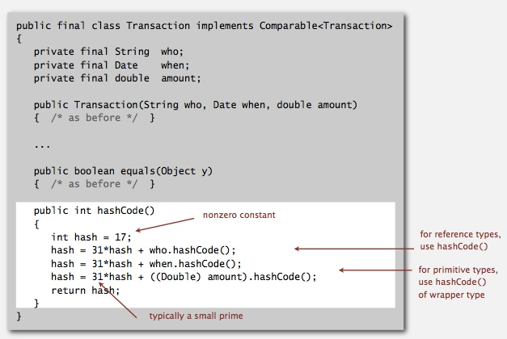

### Hash code design
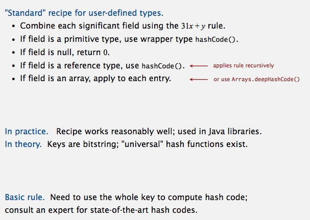

### Modular hashing
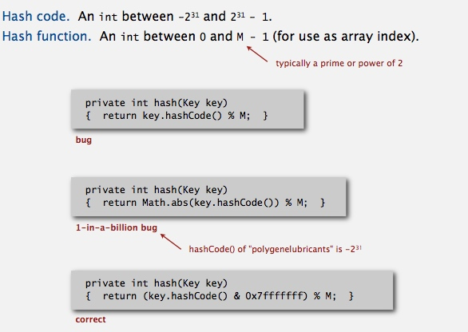

### Uniform hashing assumption
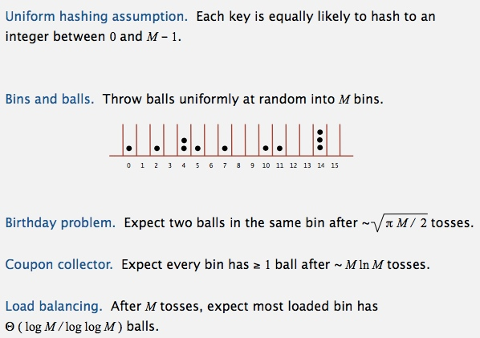

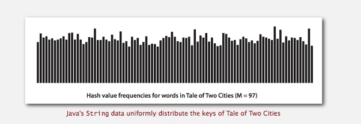

---------------------------------------------------------------------

## separate chaining
### Collisions
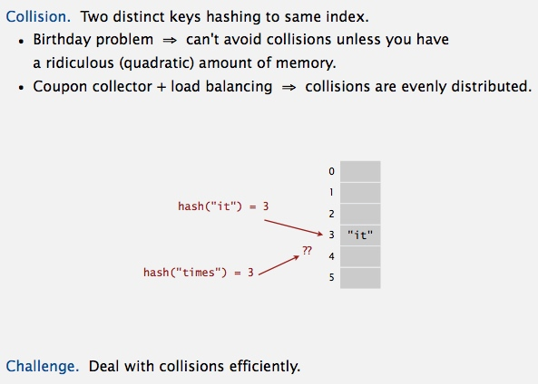

### Separate chaining symbol table
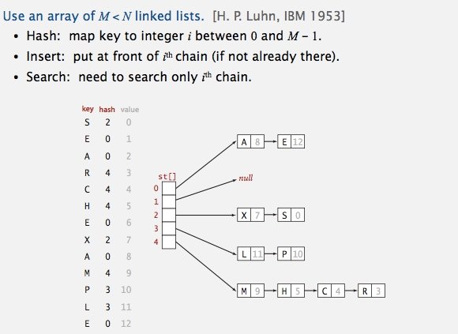

### Separate chaining ST: Java implementation
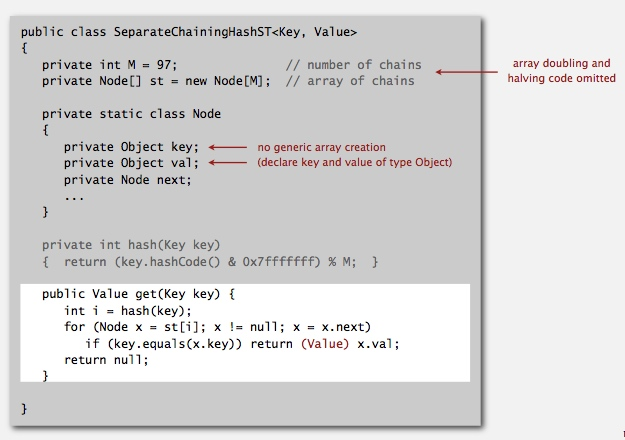

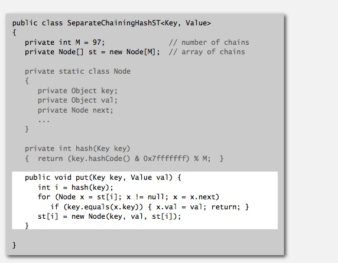

### Analysis of separate chaining
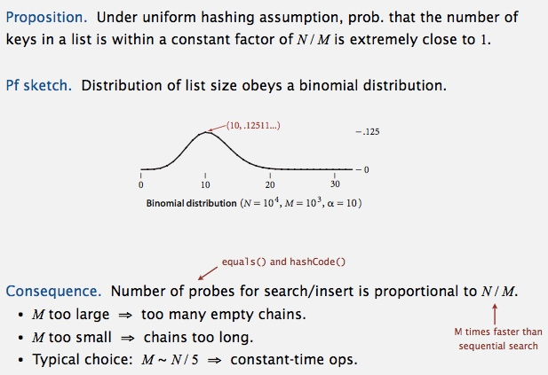

### ST implementations: summary
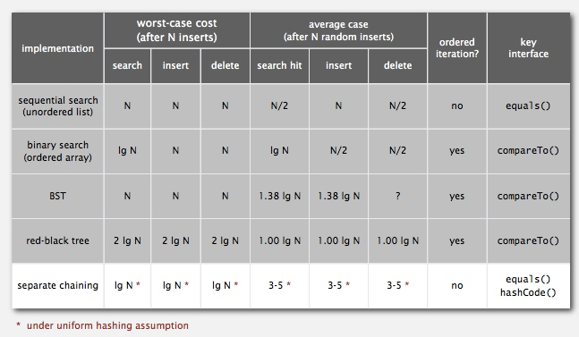

-------------------------------------------------------

## linear probing
### Collision resolution: open addressing
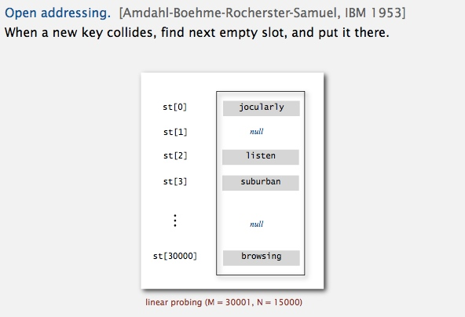

### Linear probing hash table demo
 

  
 
 
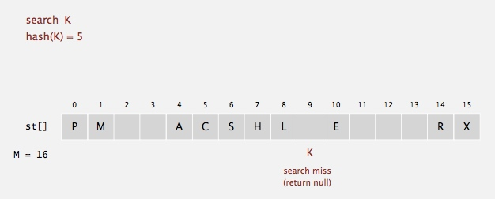

### Linear probing hash table summary
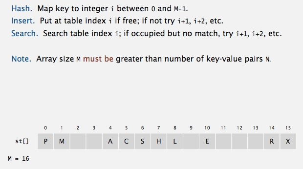

### Linear probing ST implementation
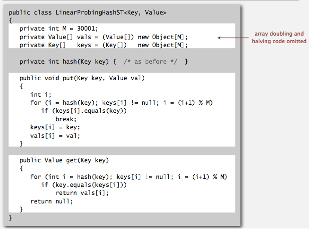

### Clustering
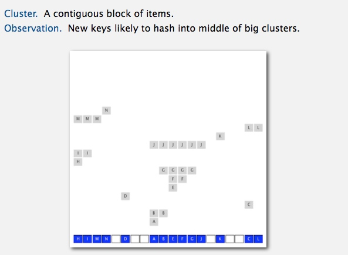

### Knuth's parking problem
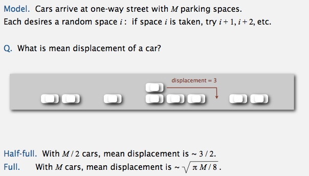

### Analysis of linear probing
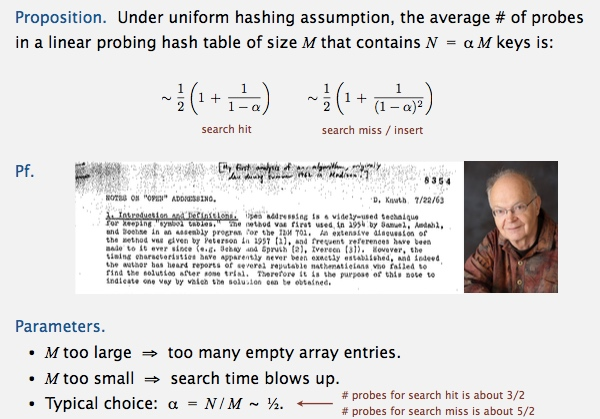

### ST implementations: summary
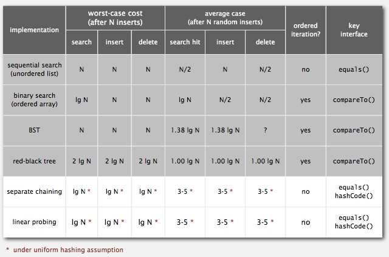

------------------------------

## context
### War story: String hashing in Java
 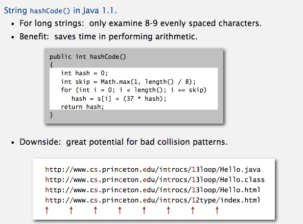

### War story: algorithmic complexity attacks
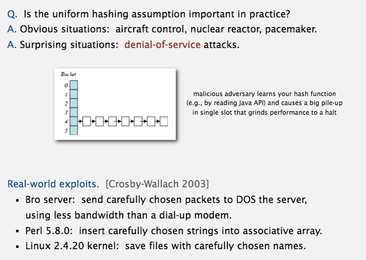

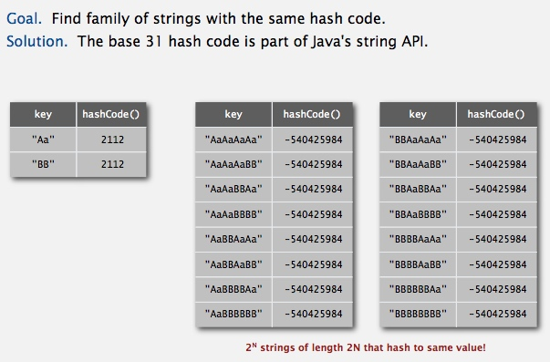

### Diversion: one-way hash functions
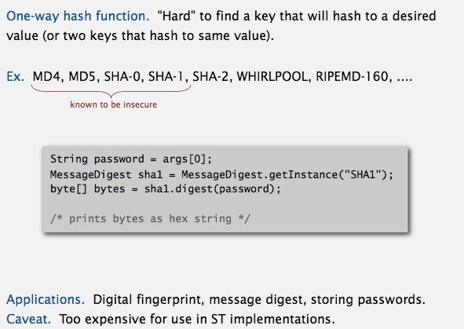

### Separate chaining vs. linear probing
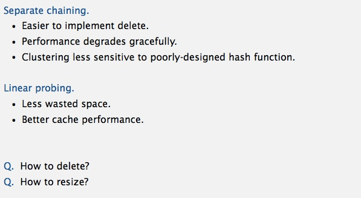

### Hashing: variations on the theme
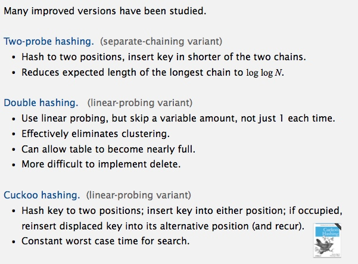

### Hash tables vs. balanced search trees
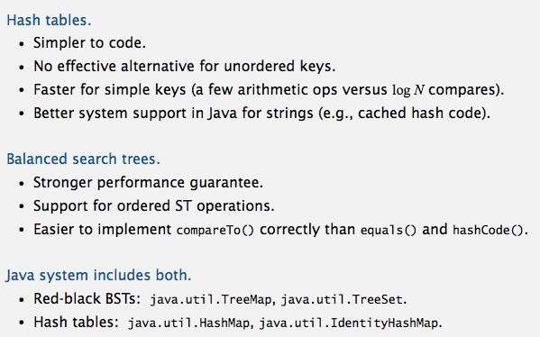

 

