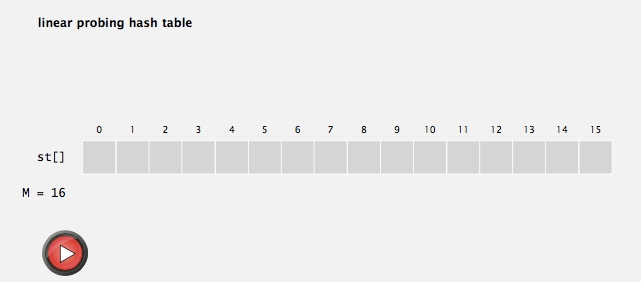

# Hash Tables

## hash functions
### Computing the hash function

### Java’s hash code conventions

### Implementing hash code: integers, booleans, and doubles

### Implementing hash code: strings

### Implementing hash code: user-defined types

### Hash code design

### Modular hashing

### Uniform hashing assumption

---------------------------------------------------------------------

## separate chaining
### Collisions

### Separate chaining symbol table

### Separate chaining ST: Java implementation

### Analysis of separate chaining

### ST implementations: summary

-------------------------------------------------------

## linear probing
### Collision resolution: open addressing

### Linear probing hash table demo
 

  
 
 

### Linear probing hash table summary

### Linear probing ST implementation

### Clustering

### Knuth's parking problem

### Analysis of linear probing

### ST implementations: summary

------------------------------

## context
### War story: String hashing in Java
 

### War story: algorithmic complexity attacks

### Diversion: one-way hash functions

### Separate chaining vs. linear probing

### Hashing: variations on the theme

### Hash tables vs. balanced search trees

 

