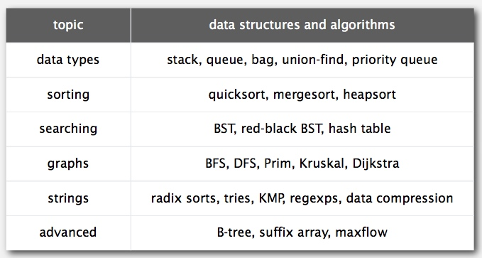

# Learning Algorithms
Steps to develop a usable algorithm:

* Model the problem.
* Find an algorithm to solve it. 
* Fast enough? Fits in memory?
* If not, figure out why.
* Find a way to address the problem. 
* Iterate until satisfied.

---------------------------------------------

### Notes
1. [Analytics of algorithms](01-AnalysisOfAlgorithms.md)
2. [Union−Find](02-Union-Find.md)
3. [Stacks And Queues](03-StacksAndQueues.md)
4. [Elementary Sorts](04-ElementarySorts.md)
5. [Merge Sort](05-Mergesort.md)
6. [Quick Sort](06-Quicksort.md)
7. [Priority Queues](07-PriorityQueues.md)
8. [Symbol Tables](08-SymbolTables.md)
9. [Binary Search Tree](09-BinarySearchTree.md)
10. [Balanced Search Trees](10-BalancedSearchTrees.md)

### Useful Graphs
#### data structures and algorithms

#### Sorting methods

